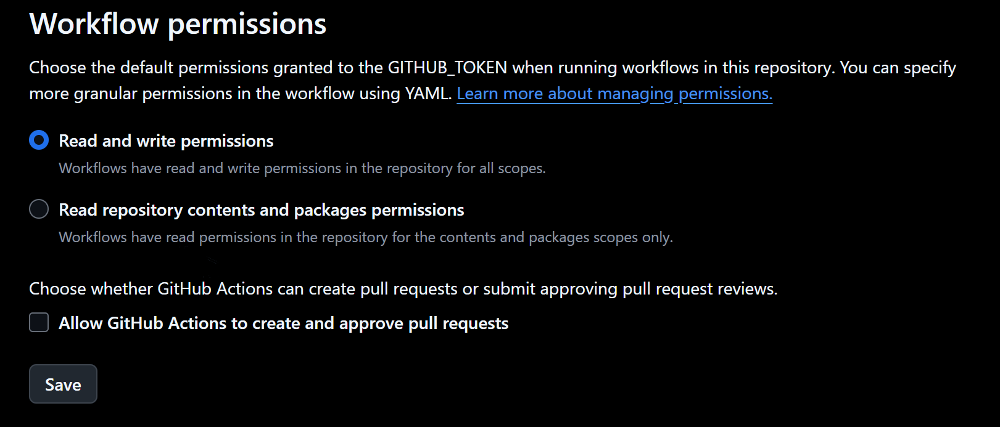
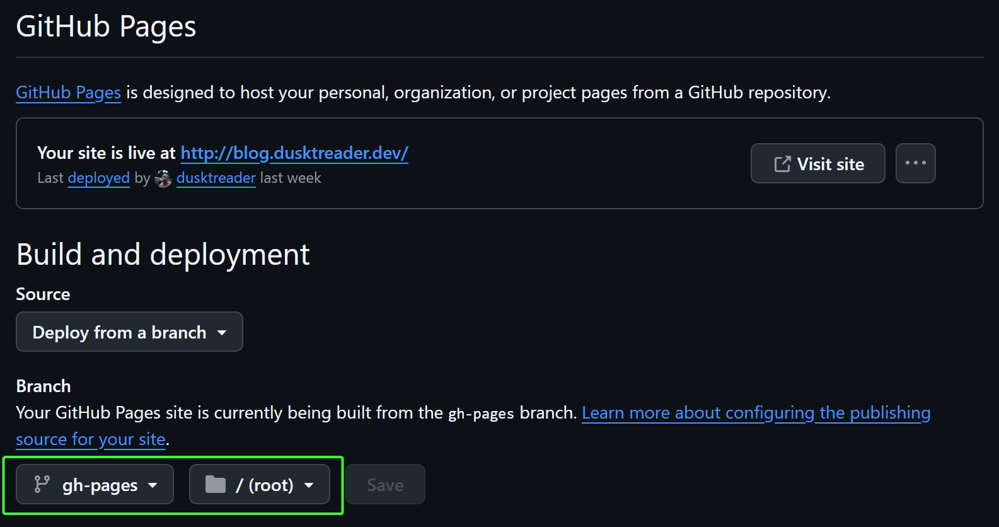
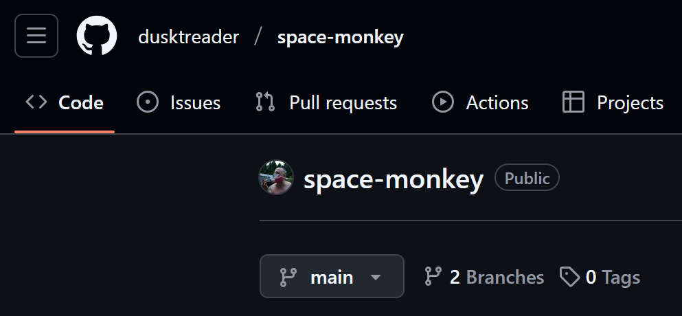
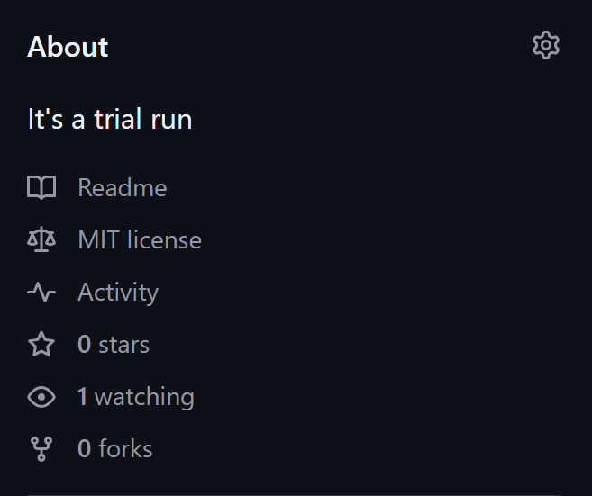
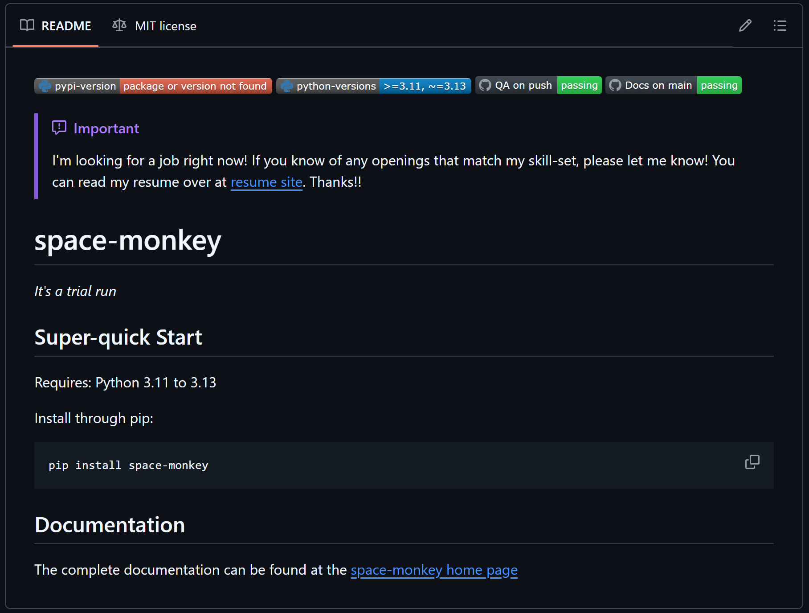
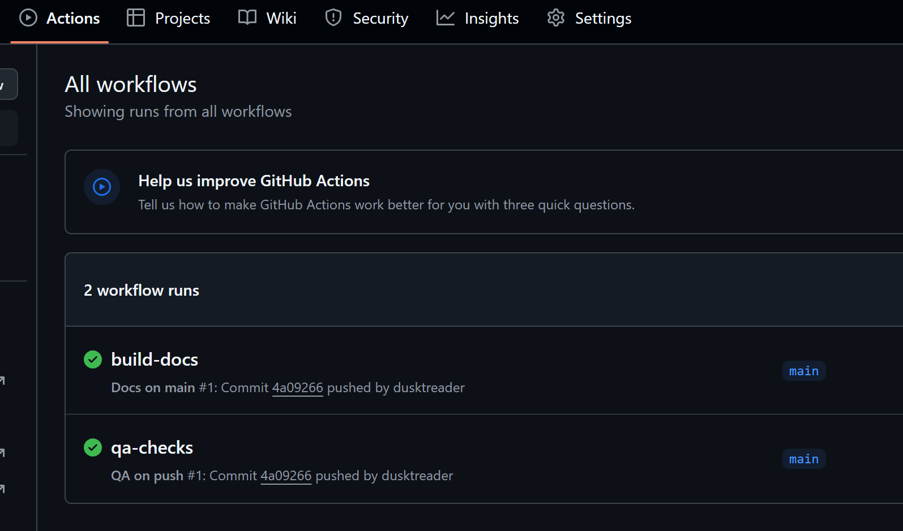
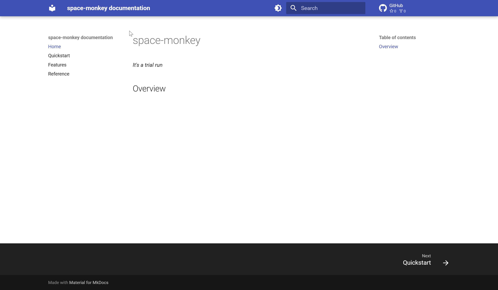

# Bootstrapping Python projects with `copier`

!!! tip "TLDR"

    I used [`copier`](https://copier.readthedocs.io/en/stable/) to create a [python project
    template](https://github.com/dusktreader/xerox-python) that includes logic to deploy the project to GitHub.

I tend to create a lot of Python projects of various sizes. In the past few weeks, this has been even more frequent.
Just a few days ago, I started a new project called [drivel](https://github.com/dusktreader/drivel). It is a
[CLI](https://aws.amazon.com/what-is/cli/) and Python package that generates fun
[metasyntactic names](https://en.wikipedia.org/wiki/Metasyntactic_variable) (think `foo`, `bar`, `baz`) to use in my
code. You can read more about it in the [drivel docs](https://dusktreader.github.io/drivel) if you want to learn more.

When I went to start this project, I did what I usually do. I copied one of my other projects to a new directory and
started ripping stuff out, renaming things, and just generally futzing around until I had the scaffolding for my new
project. This isn't hard work, but it _always_ ends up taking a lot longer than I expect.

There are a lot of conventions that I've gotten attached to in my projects over the years. And, while it's not that
hard to just borrow things from past projects, it's boring work that cries out to be automated.

So, I decided to create a project template that would allow me to do all this in just a matter of seconds.

<!-- more -->

!!!warning "Open to work"

    I'm looking for a job right now! If you know of any openings that match my skill-set, please let me know! You can
    read my resume over at my [cv site](https://cv.dusktreader.dev). Thanks!


## A case study

As I go through this article, I'm going to use an imaginary project as a case study. I'm calling it `space-monkey`,
because it's all about doing an exploratory trial run. Just like the
[monkeys and apes](https://en.wikipedia.org/wiki/Monkeys_and_apes_in_space) that were sent into orbit before humans,
this project will be used to explore and test my project template.


## The boring stuff

Before I get into how I actually built out the template, I want to take some time going over the reasons why the
projects I produce from this template are the way they are. To do that, I need to go over my personal _philosophy_ for
setting up Python projects. This might not be that interesting to you. If so, feel free to skip ahead to the
[fun stuff](#automating-the-boring-stuff).

There are some basic essentials that I like to have in my Python projects. These come in three flavors:

  1. Baseline requirements for a good project
  2. Ergonomics to make the project nice to work on
  3. Processes to make the project ready to go

Let's look at each one in a little detail.


### Baseline requirements

I am kind of a stickler for a few baseline requirements that I have for my projects. Even for small projects, I like to
make sure that requirements are met so I don't feel...icky working in my own code.

Here are the requirements that I've settled on over the years of writing Python projects:

  * A decent `README.md`
  * A `LICENSE.md` file
  * A `CHANGELOG.md`
  * A `pyproject.toml`
  * Good project structure
  * Docs

Each one of these requirements is born of past experiences working on Python projects. Along the way, I've learned some
best practices and definitely developed some rather opinionated preferences for each. As I walk through these, please
keep in mind that these are my opinions and preferences for my own projects. I don't think it's gospel; it's just what I
like.


#### `README.md`

I've become convinced  that [Markdown](https://en.wikipedia.org/wiki/Markdown) is the best format for writing
documentation at every level. I used to be pretty attached to
[reStructuredText](https://www.sphinx-doc.org/en/master/usage/restructuredtext/basics.html) (or RST), and it is a _very_
powerful spec for writing technical documentation. But it has some serious drawbacks. For one, the syntax is far more
[esoteric](https://www.sphinx-doc.org/en/master/usage/restructuredtext/basics.html#hyperlinks). Also, working with the
[Sphinx](https://www.sphinx-doc.org) documentation engine is not very fun. Overall, Markdown is just _better_. It
doesn't come out-of-the-box with all the powerful features available with Sphinx and reStructuredText, but I've found
that using Markdown with the extensions provided by [mkdocs-material](https://squidfunk.github.io/mkdocs-material/)
provides what I need and makes producing nice looking documentation a breeze.

So, I usually start with a `README.md` with a few essential elements:

* A project summary
* A "Super-quick start" section that briefly explains how to install the project.
* For a CLI or similar tool, a brief demonstration of how to run it
* A link to the documentation page

That's pretty much it. For smaller projects, I've leaned on the README to document the whole project. However, with
mkdocs-material and [GitHub Pages](https://pages.github.com/), it's so easy to stand up a docs site that I usually do
that for even small projects.


#### `LICENSE.md`

For any project that you are going to host on a public GitHub repository, you need to have a software license. The
[GitHub docs](https://docs.github.com/en/repositories/managing-your-repositorys-settings-and-features/customizing-your-repository/licensing-a-repository)
offer a good explanation:

> without a license, the default copyright laws apply, meaning that you retain all rights to your source code and no one
> may reproduce, distribute, or create derivative works from your work.

Another good reason to have a license is to make sure that you can't be held _liable_ for misuse of your software or
its failure in any situation.

As a rule, I prefer a very permissive license and use the [MIT License](https://choosealicense.com/licenses/mit/)

But, why make it a Markdown file and not not just `LICENSE` without an extension? Well, I usually use just a _little_
bit of markup in the file. More importantly, though, it signals to the OS and users that the file contains text and
should be opened with a text viewer/editor.


#### `CHANGELOG.md`

I used to be pretty lax with CHANGELOGs, but after reading [keep a changelog](https://keepachangelog.com/en/1.1.0/), I
realized that it's a pretty important element of an open-source software project.

Since I started including them, I've found that they are extremely useful for other people who want to learn about how
your project has evolved over time. More importantly, it helps identify when significant changes (like dropping version
support) came to be. Now, when I'm reading up on a project _without_ a changelog, I get pretty grumpy.


#### Structure

This is _so_ subjective. I've also been through _many_ iterations of different structures with pretty strong opinions on
each one that I adopted. I used to be pretty adamant about using a "flat layout", but these days I've adopted the
[src layout](https://packaging.python.org/en/latest/discussions/src-layout-vs-flat-layout/). In the end, the deciding
factor was that [uv](https://docs.astral.sh/uv) prefers the "src layout", and I've been using `uv` _a lot_ lately.

So, my basic project structure looks like:

```
space-monkey/
└── .github/
    ├── workflows/
    │   ├── deploy.yml
    │   ├── docs.yml
    │   └── main.yml
    ├── docs/
    │   ├── source/
    │   │   ├── features.md
    │   │   ├── index.md
    │   │   ├── quickstart.md
    │   │   └── reference.md
    │   └── mkdocs.yaml
    ├── src/
    │   └── space_monkey/
    │       ├── __init__.py
    │       ├── main.py
    │       └── py.typed
    └── tests/
        ├── __init__.py
        ├── conftest.py
        └── test_main.py
```

Note that this structure includes a `tests` directory that includes a full suite of unit tests and integration tests
when they are appropriate. I use [pytest](https://docs.pytest.org/en/stable/) to run my tests--it's really just the
best option out there.


#### Documentation

As I mentioned in the [README.md section](#readmemd), I usually put the bulk of my documentation in a static site hosted
on GitHub pages and generated by mkdocs-material. It's really easy, and it results in a nice docs site that is
searchable, themed, and familiar.

In fact, this blog itself is a GitHub Pages site built with mkdocs-material!

At a minimum, I like my docs to include an overview of the project, a good description of usage, a full explanation of
the features, examples, and a reference section that is built from the docstrings in the project.


### Ergonomics

Beyond the baseline requirements, I like to add some elements to my projects that make them nice to work on. I love
good tools that are pleasure to use, so I'm always looking for cool things I can bring into my projects to make them
more fun to work on. There are 3 core elements to all my projects that improve the ergonomics. These include:

1. A `Makefile`
2. `uv` support
3. GitHub actions

I'll explain a little about each one.


#### `Makefile`

There are a [lot of alternatives](https://en.wikipedia.org/wiki/List_of_build_automation_software#Non-Make-based_tools)
to [`make`](https://en.wikipedia.org/wiki/Make_(software)) these days. So, why do I chose something so old? It
certainly isn't the _syntax_. Instead, it's because `make` comes pre-installed in most unix systems. So, it's nice to
use something that doesn't require an installation. That might not be a great reason, but I have a good `Makefile`
structure now, so I'm sticking with it for the time being.

My `Makefile` usually has these targets:

* **test**:       run the test suite
* **lint**:       run code linters
* **types**:      run type-checkers
* **qa**:         run all three of `test`, `lint`, and `types`
* **format**:     run a code formatter
* **docs**:       build the docs
* **docs-serve**: build the docs and run them in a local, auto-refreshing server
* **clean**:      clean up all the cruft including cache files and build artifacts
* **help**:       show available `make` targets

It's really convenient to just run `make qa` and see all the quality checks being applied.


#### `uv`

Like I said before, I've been using [`uv`](https://docs.astral.sh/uv) these days for all my new projects. It's really
fast and has _most_ of the features I want in project management software for Python. Beyond that, though, it has
_massive_ adoption in the Python community. I really believe this will become the standard for Python projects in the
coming years.

I used to be a _die-hard_ supporter of [`poetry`](https://python-poetry.org/). I still like the project, but I've found
that `uv` is just nicer to use.

As a bonus, `uv` comes with built-in Python version management with a better API and faster execution times than
[pyenv](https://github.com/pyenv/pyenv) (which I used to use).

So, all my projects these days are configured for `uv` to manage them. Since `uv` doesn't have a build backend
[yet](https://github.com/astral-sh/uv/issues/3957), I fallback on using [hatchling](https://hatch.pypa.io/latest/) in my
`pyproject.toml`


#### GitHub Actions

It's _really_ nice to take advantage of [CI](https://aws.amazon.com/devops/continuous-integration/) even in small
projects. Having automated quality checks and deployments built right into a project really take it to the next level. I
usually set up three GitHub actions for my projects:

* run qa checks on any pushed branch
* build & deploy docs on any merge to `main`
* deploy a new version of the package on any tag matching a [semver](https://semver.org/) format

Many of the projects I make end up getting deployed on [PyPI](https://pypi.org/), so the third of these actions is
really nice to have. If the project won't be deployed as a package, I'll leave off the third one.


### Processes

This might be the _most_ boring of these boring parts. In general, when I'm starting a new project, I like to put it up
on GitHub right away. This allows me to work on the project from anywhere. Since I work from a rented office a few miles
down the road, it's nice to be able to just pull down the latest changes from GitHub directly instead of using
[`scp`](https://en.wikipedia.org/wiki/Secure_copy_protocol) or [`rsync`](https://linux.die.net/man/1/rsync) to move the
files around. So, to get a new project set up on GitHub, I do these steps:

1. Initialize the git repo
2. Host it on GitHub
3. Set up a GitHub Page

None of these are _interesting_, but they are important steps, and (before the new project template) they were all done
manually.


#### `git init`

That's the main command at the heart of setting up a new git repo locally. However, there's a few other things I like to
do. I like my _first_ commit to have nothing in it but a `README.md` that contains _nothing_ but the title of the
project. It's not really a fun thing to try to rebase the first commit in a git repo. So, having it be almost completely
empty means that I can use it as an immutable base for all future commits.

```bash
git init
git add REAME.md
git commit -m "Initial Commit"
```

Once that's done, my next commit will contain all of the contents (minus cruft that `make clean` will remove) of the
project. Usually, I won't _finalize_ this commit until I have the [MVP](https://www.agilealliance.org/glossary/mvp)
working. That often means making several temporary commits that all get squashed down into this one before I push it
anywhere.

```bash
git add .
git commit -m "feat: Bootstrapped the space-mokey project"
```


#### To GitHub

This is just a matter of going to [GitHub](https://github.com) and clicking the `+` button to create a new repository:

{ align=center }
/// caption
Screenshot of the plus button
///

Then, there's the fun of setting the upstream git repository hosted on GitHub as the origin for the local git
repository. Once that's done, it's just a matter of pushing `main` to origin.

```bash
git remote add origin git@github.com:dusktreader/space-monkey.git
git push origin main
```


#### GitHub Pages

Finally, to publish the docs on GitHub pages, you have to change a few settings. First, you need to go to the `settings`
for your project and find the `actions` section on the left. Once there, scroll down and find "Workflow Permissions".
Then, change it to enable "Read and write permissions".

{ align=center }
/// caption
Screenshot of actions settings
///

!!!note "Easier method"

    I discovered a little later that it's not necessary to set the Read and write permissions manually if you set the
    permissions inside of the GitHub action to build the docs like this:

    ```yaml
    jobs:
      build:
        runs-on: ubuntu-latest
        permissions:
          contents: write
          pages: write
    ```

Once that's done, while you are still in settings, the deployment branch needs to be selected. This is found under the
"Pages" section on the left. Then, the `gh-pages` branch and root folder needs to be selected. Any branch can be used
for deployment, but the [actions-gh-pages](https://github.com/peaceiris/actions-gh-pages) action that I use builds the
docs in the `gh-pages` branch by default.

{ align=center }
/// caption
Screenshot of branch and folder selection
///

Note that you can't actually _select_ the `gh-pages` branch unless it has been created already. The `actions-gh-pages`
action will do this automatically, but it must have completed successfully first. If it failed after that initial push,
it's probably because the "Read and write permissions" weren't enabled yet. It's easy to just re-run the action in that
case to build the docs.


### Summing up the boring stuff

So, now I've described all the setup and scaffolding that I like to include in a Python project. Given all that is here,
you can see why it takes a while to get everything into place for a new project. This _really is_ the boring part of a
new project. Nothing I've talked about yet is that creative or interesting.


## Automating the boring stuff

There's a seminal book about Python called [Automate the Boring Stuff with Python](https://automatetheboringstuff.com/)
by [Al Sweigart](https://alsweigart.com/) that operates on the premise that Python is a great language for automating
boring tasks. While the template project that I built doesn't _itself_ use much Python, the sentiment is a good one. The
whole point of the template project and this article is how automation takes away the drudgery of setting up a new
Python project. So, let's get into the fun part!


### Template Engine Selection

There are a few project template engines out there including the most famous:
[cookiecutter](https://github.com/cookiecutter/cookiecutter). I've used `cookiecutter` before, and it's...fine. However,
I've also found some [sharp edges](https://github.com/cookiecutter/cookiecutter/issues/723) while using it.

Overall, I just wanted to try something new, so I reached for [copier](https://copier.readthedocs.io/en/stable/).

`copier` has a lot of [cool features](https://copier.readthedocs.io/en/stable/comparisons/) that are unique to it.
Really, though, I'm only interested in creating a template to automate setting up a new Python project. After reading
over the docs for a bit, I felt good about my selection and got to work.


### Template variables

After examining a few of my old project, I identified 5 elements that are essential to a new Python project. With these
5 settings, I can bootstrap a new project that is customized and ready to go. These 5 elements can be defined by
[template variables](https://jinja.palletsprojects.com/en/stable/templates/#variables) that `copier` learns by
asking you interactive questions to get the values. The 5 elements are:

  1. `project_name`
  2. `project_summary`
  3. `module_name`
  4. `python_versions`
  5. `default_python_version`

I'll explain each one in more detail.


#### `project_name`

This will be the name of the project, the name of the folder that holds it, and the package name on PyPI. In our case
study, this is `space-monkey`.

I like my `project_name` to use [kebab case](https://developer.mozilla.org/en-US/docs/Glossary/Kebab_case) for longer
names, and I like the to name to always be lowercase.


#### `project_summary`

This is a short description of what the project is and does. It's usually just a sentence long. I use this at the top of
the `README.md`, in the docs, in the `pyproject.toml`, and on the GitHub page for the project. For `space-monkey`, let's
use "It's a trial run" as the `project_summary`.


#### `module_name`

This is the name of the Python module from which any source code is imported. Often, this is the same as the
`project_name`. However, if the `project_name` has dashes in it, a Python module can't include those. Thus it should use
[snake case](https://developer.mozilla.org/en-US/docs/Glossary/Snake_case). For `space-monkey`, the `module_name`
becomes `space_monkey`.


#### `python_versions`

These are the versions of Python that the project should support. This should be a consecutive list of Python versions
that the project's source code _will_ work in. The full list is used in the GitHub action that runs tests and
type-checks on all branches. The _range_ of versions is used in `pyproject.toml` to identify compatible Python versions
for the project.


#### `default_python_version`

This should identify the Python version that is used by default in the project. For example, the project might _support_
all the way back to Python 3.9, but I prefer to work in Python 3.13. This is the version that will get set in the
`.python-version` so that `uv` runs everything in Python 3.13 for `space-monkey`.


### `copier.yaml`

Once I knew the key elements for the `copier` project, I could constrain the questions in the `copier` configuration
file named `copier.yaml`. This file sits at the root of the template project and defines everything `copier` needs to
know in order to generate a new project.


#### Basic questions

First, I needed to define the basic questions. So, I started pretty simply:

```yaml
project_name:
  type: str
  help: What is the name of the project?

project_summary:
  type: str
  help: Provide a short summary of the project.

module_name:
  type: str
  help: What is the Python module name?
```

This was very straightforward. `copier` asks the question described by the `help` field and stores the answer provided by
the user in the template variable.

However, I realized there was an issue here. What if the user (me) enters the empty string as the `project_name`?
Since this will be used as the name of the folder to hold the project, it obviously must not be the empty string.
Additionally, as I said earlier, I want the `project_name` to be in "kebab" case and only include lowercase characters.

To make this possible, I used a `copier` validator. Fortunately, the `copier.yaml` file can include some `jinja` in it
to make things more dynamic. After setting up my validator, the `project_name` definition ended up looking
like this:

```yaml
project_name:
  type: str
  help: What is the name of the project?
  validator: |
    
    project_name must be between 4 and 40 characters
    
    
    project_name must start with a letter, followed one or more letters, digits or dashes (all lowercase).
    
```

Notice that the `validator` item in the yaml is defined as a multiline string using the `|` operator. This is because
all `jinja` directives have to be in strings so that the file itself is still valid YAML. Read more in the
[`copier` docs](https://copier.readthedocs.io/en/stable/configuring/#prompt-templating) about these constraints.

Next, I wanted to also constrain the `project_summary`. I also wanted it to have a default value that was equivalent
to the `project_name` only in "snake_case" instead of "kebab-case". I ended up writing this definition as:

```yaml
module_name:
  type: str
  help: What is the Python module name?
  default: "{{ project_name.replace('-', '_') }}"
  validator: |
    
    module_name must be between 4 and 40 characters
    
    
    module_name must start with a letter, followed one or more letters, digits or underscores (all lowercase).
    
```

I decided that I didn't care if the `project_summary` was empty, so I didn't add a validator for it.


#### Choices

For the `python_versions` question, I needed to define a set of choices that the user can choose from to limit the
answer for the supported versions of Python. This keeps the user from selecting a version of python that doesn't exist
or isn't supported any more:

```yaml
python_versions:
  type: str
  default:
    - "3.9"
    - "3.10"
    - "3.11"
    - "3.12"
    - "3.13"
  multiselect: true
  choices:
    - "3.9"
    - "3.10"
    - "3.11"
    - "3.12"
    - "3.13"
```

This works by limiting the choices to Python 3.9 through 3.13. Because I enabled `multiselect` the user can select more
than one Python version to include. Additionally, I set the default to all available versions to just make things
easier.

If you have a discerning eye, you might notice a problem here. I will be using these Python versions in `pyproject.toml`
to identify what versions my project should work with. However (according to it's
[specification](https://packaging.python.org/en/latest/guides/writing-pyproject-toml/)) `pyproject.toml` can only
specify a _range_ of versions if more than one must be supported. Thus, I could have an issue if the selected versions
were not consecutive. Choosing 3.10, 3.12, 3.13 while leaving out 3.11 would be problematic. To address this, I figured
out a validator that can handle this constraint:

```yaml
python_versions:
  type: str
  help: What Python versions will be supported?
  default:
    - "3.9"
    - "3.10"
    - "3.11"
    - "3.12"
    - "3.13"
  multiselect: true
  choices:
    - "3.9"
    - "3.10"
    - "3.11"
    - "3.12"
    - "3.13"
  validator: |
    
    
    python_versions must be a consecutive list of versions
    
```

Next, I needed to create a question for the `default_python_version`. Right away, it was clear that this _had_ to be
constrained to be one of the values chosen for `python_versions`. Additionally, I wanted this to default to the _latest_
supported Python version from the selected list. To make this happen, I made `default_python_version` quite dynamic:

```yaml
default_python_version:
  type: str
  help: What is the default Python version to use?
  default: "{{python_versions[-1]}}"
  choices: |
    
    - "{{ver}}"
    
```

With that, I'd finished defining the questions needed to define the 5 critical template variables needed for a new
project.


### Building out the project structure

`copier` uses [Jinja](https://jinja.palletsprojects.com/en/stable/) to inject the values for the template variables it
gathers from the questionnaire into not only the _contents_ of the project template files, but into their filenames as
well. To inject into files, the files must be of type `.jinja`.

Remember my [directory structure](#structure) that I laid out before? Well, now I need to convert some of those files
into Jinja templates so that I can get the correct values into them. To fast-forward a bit, the file structure now looks
like this:


```
{{project_name}}/
└── .github/
    ├── workflows/
    │   ├── deploy.yml.jinja
    │   ├── docs.yml.jinja
    │   └── main.yml.jinja
    ├── docs/
    │   ├── source/
    │   │   ├── features.md
    │   │   ├── index.md.jinja
    │   │   ├── quickstart.md.jinja
    │   │   └── reference.md.jinja
    │   └── mkdocs.yaml.jinja
    ├── src/
    │   └── {{module_name}}/
    │       ├── __init__.py
    │       ├── main.py
    │       └── py.typed
    └── tests/
        ├── __init__.py
        ├── conftest.py
        └── test_main.py.jinja
```

Every file that has a `.jinja` extension needs to have one of the 5 values injected into it. Additionally, the root
folder should use the selected `project_name`, and the module in the `src` directory should use the `module_name`.


### Making a templated file

To show how Jinja template variable injections work, check out the internals of one of the templated files:

```yaml
name: QA on push
run-name: qa-checks

on:
  push:
    branches: [ main ]
  pull_request:
    branches: [ main ]

jobs:
  test:
    runs-on: ubuntu-latest
    strategy:
      matrix:
        python-version:
          
          - '{{ ver }}'
          
    steps:
    - name: Checkout repository
      uses: actions/checkout@v4

    - name: Install uv
      uses: astral-sh/setup-uv@v5

    - name: Install python
      run:  uv python install {{ "${{ matrix.python-version }}" }}

    - name: Check Quality
      run: make qa

    - name: Upload coverage reports to Codecov
      uses: codecov/codecov-action@v5
      with:
        files: ./.coverage.xml
        token: {{ "${{ secrets.CODECOV_TOKEN }}" }}
      if: {{ "${{ !cancelled() }}" }}

    - name: Upload test results to Codecov
      uses: codecov/test-results-action@v1
      with:
        token: {{ "${{ secrets.CODECOV_TOKEN }}" }}
        files: ./.junit.xml
      if: {{ "${{ !cancelled() }}" }}
```

There's a few interesting things to take note of here. First, you can see that we are using the `python_versions` from
before to tell the GitHub action the matrix of versions to use in the test runs. It will create a separate run of the
test job for every version that was selected before.

Note down in the "Install python" step, there's something wild going on. In a vanilla GitHub action YAML file, this
section would look like:

```yaml
    - name: Install python
      run:  uv python install ${{ matrix.python-version }}
```

However, because it's a _Jinja_ file now, double curly braces mean something special. Consequently, we need to escape
the existing double curly braces. The Jinja way to do this is to make the original double curly expression a string and
surround it _again_ with double curlies. It's ugly, but it gets the job done:

```yaml
    - name: Install python
      run:  uv python install {{ "${{ matrix.python-version }}" }}
```


### Creating a template folder

By default, `copier` expects the templated project files to live in the same directory as `copier.yaml`. However,
because I have lots of _other_ files that I want as a part of my template project, that wasn't going to work for me.
Fortunately, `copier` allows you to identify a different
[subdirectory](https://copier.readthedocs.io/en/stable/configuring/#subdirectory) that holds your template. So, I
packaged up the whole project structure in a `template` subdirectory and updated my `copier.yaml` file to include a
subdirectory section like this:

```yaml
_subdirectory: template
```


### Generating a new project

Now that everything is in place, it was time to generate a new project. So, I kicked off copier with the following
command:

```bash
uv run copier copy . ..
```

Basically, I was telling `copier` to create the new project using the template defined in the current directory.
Additionally, I wanted the new project to be created in the parent of my template project. Thus, the new project live in
a sibling folder of my template project's root.

Next, I ran through the questionnaire as follows:

```
🎤 What is the name of the project?
   space-monkey
🎤 Provide a short summary of the project.
   It's a trial run
🎤 What is the Python module name?
   space_monkey
🎤 What Python versions will be supported?
   done (3 selections)
🎤 What is the default Python version to use?
   3.13

Copying from template version 0.0.0.post3.dev0+c69bc53
    create  space-monkey
    create  space-monkey/.python-version
    create  space-monkey/src
    create  space-monkey/src/space_monkey
    create  space-monkey/src/space_monkey/main.py
    create  space-monkey/src/space_monkey/__init__.py
    create  space-monkey/src/space_monkey/py.typed
    create  space-monkey/.gitignore
    create  space-monkey/tests
    create  space-monkey/tests/test_main.py
    create  space-monkey/tests/conftest.py
    create  space-monkey/tests/__init__.py
    create  space-monkey/Makefile
    create  space-monkey/CHANGELOG.md
    create  space-monkey/docs
    create  space-monkey/docs/mkdocs.yaml
    create  space-monkey/docs/source
    create  space-monkey/docs/source/features.md
    create  space-monkey/docs/source/index.md
    create  space-monkey/docs/source/reference.md
    create  space-monkey/docs/source/quickstart.md
    create  space-monkey/.github
    create  space-monkey/.github/workflows
    create  space-monkey/.github/workflows/deploy.yml
    create  space-monkey/.github/workflows/main.yml
    create  space-monkey/.github/workflows/docs.yml
    create  space-monkey/README.md
    create  space-monkey/LICENSE.md
    create  space-monkey/pyproject.toml
```

GREAT! It worked! Now I have a new Python project that includes all the scaffolding I like to have, and it's ready to
build on.

However, this doesn't fix the pain of having to set up git and GitHub. I still would have to do those manual steps to
complete the process.

So, I decided to investigate if I those steps could be automated as well.

!!!warning "SPOILER ALERT"

    They could be automated!


### Automating GitHub Deployment with Tasks

With the Python project setup all automated, I needed to find out what I could do about automating the manual steps that
are needed to roll the project out to GitHub. Remember that in the [Processes](#processes) section, I described 3 manual
steps that I needed to perform in order to get a new project up on GitHub:

1. Initialize the git repo
2. Host it on GitHub
3. Set up a GitHub Page

All these steps happen _after_ the project is functional in its MVP form and ready to make public. So, I dug deeper into
`copier` to see what it offered for automating steps like this.

It turns out that `copier` supports [tasks](https://copier.readthedocs.io/en/latest/configuring/#tasks) that run after
the project is generated. This fit my needs perfectly! However, in reading the docs on `_tasks`, something [pretty
important](https://copier.readthedocs.io/en/latest/configuring/#unsafe) jumped out:

> Copier templates can use dangerous features that allow arbitrary code execution:
>
> * Jinja extensions
> * Migrations
> * Tasks
>
> Therefore, these features are disabled by default and Copier will raise an error (and exit from the CLI with code 4)
> when they are found in a template. In this case, please verify that no malicious code gets executed by any of the used
> features. When you're sufficiently confident or willing to take the risk, set unsafe=True or pass the CLI switch
> --UNSAFE or --trust.

This _sounds_ pretty scary, BUT! I am building this project template for my own use. I _think_ I can trust executable
code that I wrote myself--though sometimes I wonder! All I needed to add to take advantage of the `_tasks` directive was
a `--trust` flag in the `copier` command:

```bash
uv run copier copy --trust . ..
```

With that handled, I worked on my tasks next.


#### Task 1: Make sure the project _works_

I decided that it would be really nice to make sure that the project is actually working as expected before I pulbished
it on GitHub. Since I already added commands for linting, unit tests, and type-checks to my `Makefile`, I could verify
that the basics in the project work with a single command: `make qa`. I added this to the `_tasks` section with a single
command:

```yaml
_tasks:
  - working_directory: "{{ project_name }}"
    command: "make qa"
```

Notice that this command sets the working directory to the `project_name`. That meant that this command is actually
executed in the generated project. I don't need to make the directory path _relative_ to the path where I run the
command because I have already directed `copier` to execute the template in the _parent_ directory of the template
project (remember the `..`). Thus, the command will be executed exactly where I wanted. I took the new task for a spin:

```
🎤 What is the name of the project?
   space-monkey
🎤 Provide a short summary of the project.
   It's a trial run
🎤 What is the Python module name?
   space_monkey
🎤 What Python versions will be supported?
   done (3 selections)
🎤 What is the default Python version to use?
   3.13

Copying from template version 0.0.0.post3.dev0+4a481f3
...

 > Running task 1 of 1: make qa
make[1]: Entering directory '/home/dusktreader/git-repos/personal/space-monkey'
uv run pytest
...
tests/test_main.py .                                                                                                                                                                                         [100%]
...
uv run ruff check src/space_monkey tests
All checks passed!
uv run mypy src/space_monkey tests --pretty
uv run basedpyright src/space_monkey tests
Success: no issues found in 5 source files
0 errors, 0 warnings, 0 notes
echo "All quality checks pass!"
All quality checks pass!
make[1]: Leaving directory '/home/dusktreader/git-repos/personal/space-monkey'
```

I omitted some output (...) here to make save some space. Still, you can see that it ran my QA checks after generating
the project and all of the checks passed. Great! Now I'm confident that the generated project had a baseline of
functinoality.


#### Task 2-6: Initialize the git repository

The next series of tasks covered the manual steps I described to [initialize the git repository](#git-init). These steps
are really easy to define in tasks:

```yaml
  - working_directory: "{{ project_name }}"
    command: "git init ."
  - working_directory: "{{ project_name }}"
    command: "git add README.md"
  - working_directory: "{{ project_name }}"
    command: "git commit -m 'Initial Commit'"
  - working_directory: "{{ project_name }}"
    command: "git add ."
  - working_directory: "{{ project_name }}"
    command: "git commit -m 'feat: Bootstrapped the {{ project_name }} project'"
```

There's not much to comment on here other than the nicety of including the templated `project_name` value in the first
git commit message. The output from this steps (with some stuff removed) looked like this:

```
 > Running task 2 of 6: git init .
Initialized empty Git repository in /home/dusktreader/git-repos/personal/space-monkey/.git/
 > Running task 3 of 6: git add README.md
 > Running task 4 of 6: git commit -m 'Initial Commit'
[main (root-commit) 4106d13] Initial Commit
 1 file changed, 29 insertions(+)
 create mode 100644 README.md
 > Running task 5 of 6: git add .
 > Running task 6 of 6: git commit -m 'feat: Bootstrapped the space-monke`y project'
[main d830fcb] feat: Bootstrapped the space-monkey project
 21 files changed, 1339 insertions(+)
 ...
```

Now, I was really getting somewhere on automating boring steps!


#### Task 7 & 8: Create the project on GitHub

For the next two steps, I needed to be able to interact with GitHub from the command-line. Fortunately, GitHub had a
very powerful CLI available that can do it all! I just had to install it. The installation wasn't _super_ clean,
but after following the [instructions in the docs](https://github.com/cli/cli/blob/trunk/docs/install_linux.md), I had
GitHub CLI up and running. Next, I needed to login through the CLI to my GitHub account:

```bash
gh auth login
```

After following the steps to complete
[device authorization flow](https://auth0.com/docs/get-started/authentication-and-authorization-flow/device-authorization-flow),
I was fully logged in.

Next, I defined the steps to create the project on GitHub and push my `main` branch to the new origin.

```
  - working_directory: "{{ project_name }}"
    command: "gh repo create --description=\"{{ project_summary }}\" --source=. --public {{ project_name }}"
  - working_directory: "{{ project_name }}"
    command: "git push -u origin main"
```

The `create` command is really straightforward, and it's nice that I could use the `project_summary` as the project
description on GitHub. Executing the tasks looked like this:

```
 > Running task 7 of 8: gh repo create --description="It's a trial run" --source=. --public space-monkey
2025/04/06 11:28:35.534717 cmd_run.go:1285: WARNING: cannot start document portal: dial unix /run/user/1000/bus: connect: connection refused
✓ Created repository dusktreader/space-monkey on GitHub
✓ Added remote git@github.com:dusktreader/space-monkey.git
 > Running task 8 of 8: git push -u origin main
Enumerating objects: 30, done.
Counting objects: 100% (30/30), done.
Delta compression using up to 8 threads
Compressing objects: 100% (23/23), done.
Writing objects: 100% (30/30), 30.07 KiB | 2.15 MiB/s, done.
Total 30 (delta 1), reused 0 (delta 0), pack-reused 0 (from 0)
remote: Resolving deltas: 100% (1/1), done.
To github.com:dusktreader/space-monkey.git
 * [new branch]      main -> main
branch 'main' set up to track 'origin/main'.
```

When I went to check the repo on GitHub, I could see that it was all set up!

{ align=center }
/// caption
space-monkey now on GitHub!
///

{ align=center }
/// caption
about section has the summary
///

{ align=center }
/// caption
space-monkey README
///

And, when I checked the Actions, I verified that the docs build succeeded as well:

{ align=center }
/// caption
space-monkey build-docs action
///

However, the GitHub Pages site for the docs was not built yet, because it wasn't configured as I described in
the [GitHub Pages section](#github-pages). So, I needed a few more actions to make that happen.


#### Task 9-11: Publish the GitHub Page

Figuring out how to configure my repo to publish the GitHub Pages site took some digging. I found that this
functionality isn't actually built in to the GitHub CLI directly. However, the CLI does allow you to call any API
endpoint provided by GitHub! Once I learned that, it was only a matter of finding the endpoint and learning how to call
it. The complete CLI command looked like this (I've broken it up into several lines to make it easier to read):

```bash
gh api \
  --method=POST \
  -H "Accept: application/vnd.github+json" \
  "/repos/dusktreader/so-dumb/pages" \
  -f "source[branch]=gh-pages" \
  -f "source[path]=/" \
  -f "build_type=legacy"
```

It worked, but I quickly realized there was a problem. This command will _only_ work after the GitHub action to build
the docs is completed. That action _creates_ a new branch in the repo called `gh-pages` where the built docs are staged.
If you try to run the GitHub API command before that branch exists, it will fail.

So, I needed to make sure that the `build-docs` action completed before I ran the command. That took even _more_
digging, but I was able to figure out how to do it in two steps:

1. Wait for the `build-docs` action to start
2. Once it's started, wait for it to complete

After refining those steps into tasks, my YAML looked like this:

```yaml
  - working_directory: "{{ project_name }}"
    command: >
      while [ -z "$(gh run list --json databaseId,name | jq '.[] | select(.name == "build-docs")')" ]; do
        echo "Waiting for docs build action to start" && sleep 1;
      done
  - working_directory: "{{ project_name }}"
    command: >
      gh run list --json databaseId,name
      | jq '.[] | select(.name == "build-docs")'
      | jq '.databaseId'
      | xargs gh run watch --exit-status
  - working_directory: "{{ project_name }}"
    command: >
      gh api
      --silent
      --method=POST
      -H "Accept: application/vnd.github+json"
      "/repos/dusktreader/{{ project_name }}/pages"
      -f "source[branch]=gh-pages"
      -f "source[path]=/"
      -f "build_type=legacy"
```

Once I had the tasks in place, running it produced this output:

```
 > Running task 9 of 10: while [ -z "$(gh run list --json databaseId,name | jq '.[] | select(.name == "build-docs")')" ]; do
  echo "Waiting for docs build action to start" && sleep 1;
done

Waiting for docs build action to start
Waiting for docs build action to start
Waiting for docs build action to start
 > Running task 10 of 10: gh run list --json databaseId,name | jq '.[] | select(.name == "build-docs")' | jq '.databaseId' | xargs gh run watch --exit-status

Refreshing run status every 3 seconds. Press Ctrl+C to quit.

✓ main build-docs · 14295750274
Triggered via push less than a minute ago

JOBS
✓ build in 12s (ID 40062668601)
  ✓ Set up job
  ✓ Checkout repository
  ✓ Install uv
  ✓ Set up Python
  ✓ Build Documentation
  ✓ Deploy documentation
  ✓ Post Install uv
  ✓ Post Checkout repository
  ✓ Complete job

✓ Run build-docs (14295750274) completed with 'success'
 > Running task 11 of 11: gh api --method=POST -H "Accept: application/vnd.github+json" "/repos/dusktreader/space-monkey/pages" -f "source[branch]=gh-pages" -f "source[path]=/" -f "build_type=legacy"
```

That's it! My project is now available on GitHub and the docs page is also built...well, not yet actually. The page
wasn't deployed yet because the final GitHub action named "pages build and deployment" had to finish first. So, I
decided to add one last finishing touch.


#### Task 12-14: Wrapping it up

For this final step, I just needed to add another task to wait for the page deployment to complete. I also wanted to add
a message at the end confirming that the tasks completed successfully and include a URL to the new GitHub repo so that I
could open it with a click. The final tasks looked like this:

```yaml
  - working_directory: "{{ project_name }}"
    command: >
      while [ -z "$(gh run list --json databaseId,name | jq '.[] | select(.name == "pages build and deployment")')" ]; do
        echo "Waiting for page deploy action to start" && sleep 1;
      done
  - working_directory: "{{ project_name }}"
    command: >
      gh run list --json databaseId,name
      | jq '.[] | select(.name == "pages build and deployment")'
      | jq '.databaseId'
      | xargs gh run watch --exit-status
  - working_directory: "{{ project_name }}"
    command: >
      echo "Finished bootstrapping {{ project_name }}!" &&
      echo "Check it out at https://github.com/dusktreader/{{ project_name }}"
```

This produced output from `copier` that looked like this:

```
 > Running task 12 of 14: while [ -z "$(gh run list --json databaseId,name | jq '.[] | select(.name == "pages build and deployment")')" ]; do
  echo "Waiting for page deploy action to start" && sleep 1;
done

Waiting for docs build action to start
Waiting for docs build action to start
Waiting for docs build action to start
 > Running task 13 of 14: gh run list --json databaseId,name | jq '.[] | select(.name == "pages build and deployment")' | jq '.databaseId' | xargs gh run watch --exit-status
Refreshing run status every 3 seconds. Press Ctrl+C to quit.

✓ gh-pages pages build and deployment · 14295984823
Triggered via dynamic less than a minute ago

JOBS
✓ build in 7s (ID 40063197951)
  ✓ Set up job
  ✓ Checkout
  ✓ Upload artifact
  ✓ Post Checkout
  ✓ Complete job
✓ report-build-status in 3s (ID 40063199711)
  ✓ Set up job
  ✓ Report Build Status
  ✓ Complete job
✓ deploy in 10s (ID 40063199712)
  ✓ Set up job
  ✓ Deploy to GitHub Pages
  ✓ Complete job

✓ Run pages build and deployment (14295984823) completed with 'success'
 > Running task 14 of 14: echo "Finished bootstrapping space-monkey!" && echo "Check it out at https://github.com/dusktreader/space-monkey"

Finished bootstrapping space-monkey!
Check it out at https://github.com/dusktreader/space-monkey
```

Excellent! I clicked on the URL at the end and checked out the docs:

{ align=center }
/// caption
space-monkey docs page!
///

There they were! After all that work, my template project was ready to stamp out new Python projects!


## Conclusion

My template project was pretty much complete at this point. It could produce a mostly empty Python
project, but all of the scaffolding was complete and the project was published on GitHub.

Running the whole process took just over a minute:

```
real    1m15.743s
user    0m8.678s
sys     0m2.462s
```

I am really happy with how this turned out. Still, I don't think the template project is 100% done yet. In particular,
there are a few things I'd like to improve in it:

1. Cleaning up some of the output so it's not so noisy
2. Encapsulating the GitHub CLI commands in scripts to make the YAML more concise
3. Figuring out how to seed the list of python versions with a reusable variable
4. Making the GitHub user account a question so other people can use the template more easily
5. Adding some optional components so I can bootstrap CLI apps vs API apps
6. Configuring GitHub to set the URL of the docs page in the "About" section

This is a solid start, though, and definitely a tool that I will find really useful for future Python projects.

If you are interested in the nitty-gritty details of the template, please check out my
[xerox-python](https://github.com/dusktreader/xerox-python) project on GitHub. Comments, issues, and PRs are always
welcome.

Before I take off, I'd like to thank the [maintiners](https://github.com/copier-org/copier?tab=readme-ov-file#credits)
of `copier` for creating such a great template builder. It really was a joy to work with!

So, what do you think? Let me know below in the comments.

Thanks for reading!
