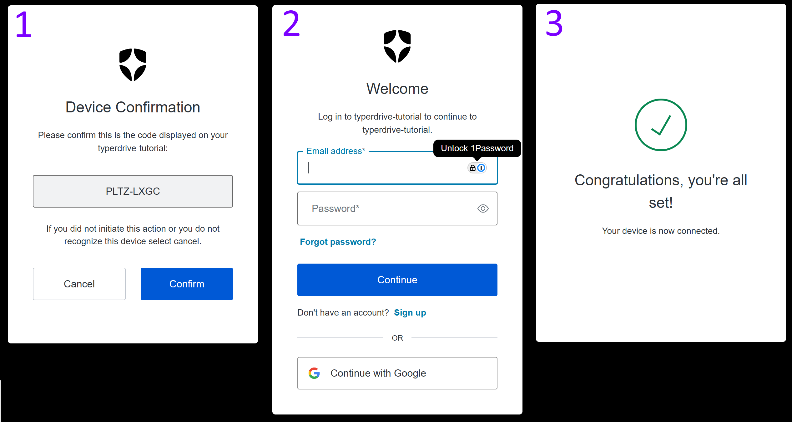

# Introducing Typerdrive: Boost your command-line workflows to lightspeed

!!! tip "TLDR"
    I created a package to extend Typer with some great features for building CLIs that communicate with APIs.

During my time as an engineer working primarily with Python, I've written a a fair number of CLIs. One type of project
that has been popping up for me a lot lately involves writing CLI programs that interface with RESTful APIs. These are
pretty common these days with so many service companies offering fully operational battlestations...I mean, platforms
that can be accessed via API.

I've established some pretty useful and re-usable patterns in building these kinds of apps, and I keep finding new
ways to improve both the developer experience and the user experience. Every time I go about porting some feature
across to a new or old CLI, I wish there was a library that wrapped them all up in a nice package. Now, there is:

[](https://github.com/dusktreader/typerdrive){target="blank"}
[](https://github.com/dusktreader/typerdrive){target="blank"}


<!-- more -->

> She may not look like much, but she’s got it where it counts, kid. I’ve made a lot of special modifications myself.
> --Han Solo

These are the challenges I found myself facing repeatedly when building CLIs that talk to APIs:

- **Settings management**: so you're not providing the same values as arguments over and over
- **Cache management**: to store auth tokens you use to access a secure API
- **Handling errors**: repackaging ugly errors and stack traces into nice user output
- **Client management**: serializing data into and out of your requests
- **Logging management**: storing and reviewing logs to diagnose errors

`typerdrive` wraps all this up into an interface that's easy for users and developers as well.

Each of these feature is fully documented in the
[`typerdrive` docs](https://dusktreader.github.io/typerdrive/){target="blank"}. There are also a full set of
[examples](https://github.com/dusktreader/typerdrive/tree/main/examples){target="blank"} and
[demos](https://dusktreader.github.io/typerdrive/demo/){target="blank"} showing how to use them. Still, I thought it
would be good to show how they could be used in actual app. I'm going to go over that with you in this walkthrough!


## Setup

First of all, the complete code for the "tutorial" app is available in its own github repository called
[typerdrive-tutorial](https://github.com/dusktreader/typerdrive-tutorial){target="blank"}. So, if you want to just dig
in and see how it works, you can start there.

I'm going to incrementally build this code as I walk through the features of `typerdrive` and how they are useful for
both users and developers.

This walkthrough will show you how to use `typerdrive` to build a CLI that accesses secured API endpoints. To make
this setup as easy as possible, I'm using a FastAPI instance secured with
[`armasec`](https://omnivector-solutions.github.io/armasec/){target="blank"}.

!!! warning "Bias alert"
    I wrote `armasec`, so my opinion on how easy it is to use is probably a bit biased.

So, to prepare things for this app, I followed the instructions here to set up
[Auth0](https://auth0.com){target="blank"} with `armasec` as documented in [this
guide](https://omnivector-solutions.github.io/armasec/tutorials/getting_started_with_auth0/){target="blank"}.

To keep things lean and simple, I skipped the steps involved with setting up
[RBAC](https://auth0.com/docs/manage-users/access-control/rbac){target="blank"}. Enabling RBAC won't _hurt_ anything,
but it's not necessary for this tutorial.

If you want to follow along on your own machine, you will need to complete the setup of an Auth0 client for yourself.
You can do this for free with Auth0.

If you are feeling ambitious, you could do all this with a local Keycloak instance as well by following
[this guide](https://omnivector-solutions.github.io/armasec/tutorials/getting_started_with_keycloak/){target="blank"}.
Note that the URLs used to access Keycloak are different than those for Auth0, so you will need to modify the code
provided in this walkthrough in some places.

OK, once you have an OIDC (Auth0 or Keycloak) provider setup, you are ready to follow along.


## The API

The API itself is really basic. It has two endpoints:

- `/unsecured`: allows access to anyone
- `/secured`: requires a logged in user

The code for this API is _really_ straightforward:

```python linenums="1" title="api.py"
from fastapi import FastAPI, Depends
from armasec import Armasec


app = FastAPI()
armasec = Armasec(
    domain="typerdrive-tutorial.us.auth0.com",
    audience="typerdrive-tutorial",
)


@app.get("/unsecured")
async def unsecured():
    return dict(message="Accessed unsecured endpoint!")


@app.get("/secured", dependencies=[Depends(armasec.lockdown())])
async def check_access():
    return dict(message="Accessed secured endpoint!")
```

If you are following along, you will have to replace the `Armasec` values for `domain` and `audience` with whatever you
selected during the Auth0 setup.

That's it. This FastAPI app will use `armasec` to secure the `/secured` endpoint. The `/unsecured` endpoint has no such
protection.

Start the API up by running:

```
fastapi dev src/typerdrive_tutorial/api.py
```

This will start up a local instance of the API running on port 8000. To see the available endpoints, you can open a
browser with `http://localhost:8000/docs`

That's it. The API is ready to receive both secured and unsecured requests. Let's test it out by hitting the unsecured
endpoint with cURL:

```
$ curl -i http://localhost:8000/unsecured
HTTP/1.1 200 OK
date: Mon, 12 May 2025 16:13:08 GMT
server: uvicorn
content-length: 42
content-type: application/json

{"message":"Accessed unsecured endpoint!"}
```

Great! The API is working. Of course, if you try to access the secured endpoint it will give you a 401 because you're
not (yet) providing an auth header:

```
$ curl -i http://localhost:8000/secured
HTTP/1.1 401 Unauthorized
date: Mon, 12 May 2025 16:13:30 GMT
server: uvicorn
www-authenticate: Bearer
content-length: 30
content-type: application/json

{"detail":"Not authenticated"}
```

Great! The API is ready to process requests from the CLI.


## Building the CLI

Now that the API is ready to go, we can start building our CLI with `typerdrive`.


### Step 1: Create the CLI skeleton

In this tutorial, we will build a CLI that has two main commands:

- `login`: Log in to Auth0 and get an access token
- `access`: Access secured or unsecured endpoints

!!! info "More commands incoming"
    As we integrate `typerdrive`, more commands will _become_ available, and those will be explained as we go.


#### Initial code

First, we'll set up the skeleton of our API with the two commands like so:

```python linenums="1" title="cli.py"
import typer
from typerdrive import terminal_message


app = typer.Typer()


@app.command()
def access():
    terminal_message("Processing access command")


@app.command()
def login():
    terminal_message("Processing login command")
```

Now, this bare-bones CLI won't really do _anything_, it just prints a message for either command.


#### Running the commands

Let's try it out:

```
$ typerdrive-tutorial access

╭──────────────────────────────────────────────────────────────────────────────╮
│                                                                              │
│   Processing access command                                                  │
│                                                                              │
╰──────────────────────────────────────────────────────────────────────────────╯
```

The `terminal_message()` function imported from `typerdrive` just prints nicely formatted messages with
[`rich`](https://github.com/Textualize/rich){target="blank"}. You can make the output much fancier, as you will see
later in this walkthrough.


### Step 2: Use an http client to access API endpoints

Let's start building out functionality by using an http client to access the API endpoints.

First, we'll use a vanilla [`httpx`](https://www.python-httpx.org){target="blank"} client to issue requests to the API.

!!! question "Why httpx and not requests?"
    I _vastly_ prefer `httpx` over `requests`; that's why this tutorial and `typerdrive` itself uses it.
    `typerdrive` includes `httpx` as a dependency, so you will not need to install it separately.


#### Updated code

Let's update the `access()` function like this:

```python linenums="1" title="cli.py" hl_lines="1 3 8-10 17-25"
from enum import StrEnum, auto

import httpx
import typer
from typerdrive import terminal_message


class Endpoint(StrEnum):
    unsecured = auto()
    secured = auto()


app = typer.Typer()


@app.command()
def access(endpoint: Endpoint):
    response = httpx.get(f"http://localhost:8000/{endpoint}")
    response.raise_for_status()
    message = response.json()["message"]
    terminal_message(
        message,
        subject="Successfully connected to API",
        footer=f"Status Code: {response.status_code}",
    )


@app.command()
def login():
    terminal_message("Processing login command")
```

Let's walk through what's going on here:

First, we add an `Endpoint` enum so that we can add a
[Typer `argument`](https://typer.tiangolo.com/tutorial/arguments/){target="blank"} that controls which endpoint we
send a request to. If you run the CLI with the `--help` command, you can see that it requires you to supply either
"unsecured" or "secured" for this argument:

```
$ typerdrive-tutorial access --help

 Usage: typerdrive-tutorial access [OPTIONS] ENDPOINT:{unsecured|secured}

╭─ Arguments ──────────────────────────────────────────────────────────────────╮
│ *    endpoint      ENDPOINT:{unsecured|secured}  [default: None] [required]  │
╰──────────────────────────────────────────────────────────────────────────────╯
╭─ Options ────────────────────────────────────────────────────────────────────╮
│ --help          Show this message and exit.                                  │
╰──────────────────────────────────────────────────────────────────────────────╯
```

The request is sent to the API via `httpx` at the chosen endpoint. Notice that we included
`response.raise_for_status()`? This will simply throw an exception if any error responses are returned. Error responses
have [http status codes](https://developer.mozilla.org/en-US/docs/Web/HTTP/Reference/Status){target="blank"} in the 400
and 500 range.

Next, we unpack the "message" from the response payload and show it to the user with a fancier version of
`terminal_message()`.


#### Running the commands

Let's try it out:

```
$ typerdrive-tutorial access unsecured

╭─ Successfully connected to API ──────────────────────────────────────────────╮
│                                                                              │
│   API response: {'message': 'Accessed unsecured endpoint!'}                  │
│                                                                              │
╰─ Status Code: 200 ───────────────────────────────────────────────────────────╯
```

Awesome! We connected to the API and got a 200 response from the `/unsecured` endpoint. This is exactly what we wanted
to see. So, now what happens when we hit the `/secured` endpoint?

```
$ typerdrive-tutorial access secured
╭─────────────────── Traceback (most recent call last) ────────────────────────╮
│ /home/dusktreader/git-repos/personal/typerdrive-tutorial/src/typerdrive_tuto │
│ rial/cli.py:19 in access                                                     │
│                                                                              │
│   16 @app.command()                                                          │
│   17 def access(endpoint: Endpoint):                                         │
│   18 │   response = httpx.get(f"http://localhost:8000/{endpoint}")           │
│ ❱ 19 │   response.raise_for_status()                                         │
│   20 │   message = response.json()["message"]                                │
│   21 │   terminal_message(                                                   │
│   22 │   │   message,                                                        │
│                                                                              │
│ ╭───────────────── locals ─────────────────╮                                 │
│ │ endpoint = <Endpoint.secured: 'secured'> │                                 │
│ │ response = <Response [401 Unauthorized]> │                                 │
│ ╰──────────────────────────────────────────╯                                 │
│                                                                              │
│ /home/dusktreader/git-repos/personal/typerdrive-tutorial/.venv/lib/python3.1 │
│ 3/site-packages/httpx/_models.py:829 in raise_for_status                     │
│                                                                              │
│    826 │   │   }                                                             │
│    827 │   │   error_type = error_types.get(status_class, "Invalid status co │
│    828 │   │   message = message.format(self, error_type=error_type)         │
│ ❱  829 │   │   raise HTTPStatusError(message, request=request, response=self │
│    830 │                                                                     │
│    831 │   def json(self, **kwargs: typing.Any) -> typing.Any:               │
│    832 │   │   return jsonlib.loads(self.content, **kwargs)                  │
│                                                                              │
│ ╭─────────────────────────── locals ───────────────────────────────────────╮ │
│ │   error_type = 'Client error'                                            │ │
│ │  error_types = {                                                         │ │
│ │                │   1: 'Informational response',                          │ │
│ │                │   3: 'Redirect response',                               │ │
│ │                │   4: 'Client error',                                    │ │
│ │                │   5: 'Server error'                                     │ │
│ │                }                                                         │ │
│ │      message = "Client error '401 Unauthorized' for url                  │ │
│ │                'http://localhost:8000/secured'\nFor more"+80             │ │
│ │      request = <Request('GET', 'http://localhost:8000/secured')>         │ │
│ │         self = <Response [401 Unauthorized]>                             │ │
│ │ status_class = 4                                                         │ │
│ ╰──────────────────────────────────────────────────────────────────────────╯ │
╰──────────────────────────────────────────────────────────────────────────────╯
HTTPStatusError: Client error '401 Unauthorized' for url
'http://localhost:8000/secured'
For more information check:
https://developer.mozilla.org/en-US/docs/Web/HTTP/Status/401
```

This should be expected. Without a valid auth token, the secured endpoint will reject the request with a
`401: Not Authenticated` response. However, this is a very unfriendly message to show to your users. That stack trace
might be super valuable to you, a developer, who needs to find out what went wrong, but it will confuse the hell out of
any enduser that's using your app.


### Step 3: Handling errors

It can be toilsome to handle error conditions to make sure that you are providing friendlier output for the end user.
You will find yourself using the same code over and over to capture an error and re-format it nicely as well as exiting
gracefully.

`typerdrive` provides
[error handling](https://dusktreader.github.io/typerdrive/features/exceptions/){target="blank"} that can make this much
easier for you and nice for your users as well.


#### Updated code

Let's update the code to add error handling:

```python linenums="1" title="cli.py" hl_lines="13-14 21 24-27"
from enum import StrEnum, auto

import httpx
import typer
from typerdrive import terminal_message, handle_errors, TyperdriveError


class Endpoint(StrEnum):
    unsecured = auto()
    secured = auto()


class TutorialError(TyperdriveError):
    pass


app = typer.Typer()


@app.command()
@handle_errors("Failed to access the API")
def access(endpoint: Endpoint):
    response = httpx.get(f"http://localhost:8000/{endpoint}")
    TutorialError.require_condition(
        response.status_code == 200,
        f"Expected status code 200, but got {response.status_code}",
    )
    message = response.json()["message"]
    terminal_message(
        message,
        subject="Successfully connected to API",
        footer=f"Status Code: {response.status_code}",
    )

@app.command()
def login():
    terminal_message("Processing login command")
```

Alright, let's talk through these changes. First, we are creating our own exception class. This is based off of
`TyperdriveError` which itself is a variant of a `Buzz` exception from
[`py-buzz`](https://github.com/dusktreader/py-buzz){target="blank"}. By default the
[`@handle_errors()`](https://dusktreader.github.io/typerdrive/features/exceptions/#details){target="blank"} decorator
will handle all `TyperdriveError` exceptions (including descendant exception classes). Instead of hitting your user with
an inscrutable stack trace and confusing error message, `typerdrive` will capture the error and provide a clear
explanation for your user.


#### Running the commands

Let's try it out:

```
$ typerdrive-tutorial access secured

╭─ Failed to access the API ───────────────────────────────────────────────────╮
│                                                                              │
│   Expected status code 200, but got 401                                      │
│                                                                              │
╰──────────────────────────────────────────────────────────────────────────────╯
```

That's much nicer for the user! Notice that the "subject" of the message is the string you passed to `handle_errors()`.
The message shown in the box will be the `TyperdriveError`'s message attribute.

This may be much better for the user, but for you as a maintainer it could be very hard to diagnose what went wrong.
This time, it's an obvious 401 issue, but if you were getting a 400 here you would probably want to dig into the details
a bit more.


### Step 4: Add Logging

Logging is a great way to capture details about runtime issues. Setting it up isn't necessarily hard, but it does
involve some repetetive boilerplate. `typerdrive` provides a
[logging feature](https://dusktreader.github.io/typerdrive/features/logging/){target="blank"} that makes it very easy to
set up logging so that the messages are captured on disk in a sensible place and are easy to access. It even handles
[log rotation](https://en.wikipedia.org/wiki/Log_rotation){target="blank"} to ensure that a single log file doesn't get
too large to manage.


#### Updated code

Let's update the code to enable logging and then talk through the changes:

```python linenums="1" title="cli.py" hl_lines="5 8-9 11 26 31 33 35"
from enum import StrEnum, auto

import httpx
import typer
from loguru import logger
from typerdrive import (
    TyperdriveError,
    add_logs_subcommand,
    attach_logging,
    handle_errors,
    log_error,
    terminal_message,
)


class Endpoint(StrEnum):
    unsecured = auto()
    secured = auto()


class TutorialError(TyperdriveError):
    pass


app = typer.Typer()
add_logs_subcommand(app)


@app.command()
@handle_errors("Failed to access the API", do_except=log_error)
@attach_logging()
def access(ctx: typer.Context, endpoint: Endpoint):
    logger.debug(f"Attempting to access api {endpoint=}")
    response = httpx.get(f"http://localhost:8000/{endpoint}")
    logger.debug(f"Got {response.status_code=}")
    TutorialError.require_condition(
        response.status_code == 200,
        f"Expected status code 200, but got {response.status_code}",
    )
    message = response.json()["message"]
    terminal_message(
        message,
        subject="Successfully connected to API",
        footer=f"Status Code: {response.status_code}",
    )

@app.command()
def login():
    terminal_message("Processing login command")
```

If you were to run the commands as before, you wouldn't see any effect from these changes. Logs _are_ being captured,
though, and `typerdrive` can help you examine them. First, though, let's discuss the changes.

After initializing the Typer app, we invoke the `add_logs_subcommand()` to add additional commands for managing logs to
our app. You can examine them with the `--help()` flag:

```
$ typerdrive-tutorial --help

 Usage: typerdrive-tutorial [OPTIONS] COMMAND [ARGS]...

╭─ Options ───────────────────────────────────────────────────────────────────────────────╮
│ --install-completion          Install completion for the current shell.                 │
│ --show-completion             Show completion for the current shell, to copy it or      │
│                               customize the installation.                               │
│ --help                        Show this message and exit.                               │
╰─────────────────────────────────────────────────────────────────────────────────────────╯
╭─ Commands ──────────────────────────────────────────────────────────────────────────────╮
│ access                                                                                  │
│ login                                                                                   │
│ logs     Manage logs for the app                                                        │
╰─────────────────────────────────────────────────────────────────────────────────────────╯
```

There we can see the new `logs` command, and we can dig into that deeper by running it with the `--help` flag as well:

```
$ typerdrive-tutorial logs --help

 Usage: typerdrive-tutorial logs [OPTIONS] COMMAND [ARGS]...

 Manage logs for the app


╭─ Options ───────────────────────────────────────────────────────────────────────────────╮
│ --help          Show this message and exit.                                             │
╰─────────────────────────────────────────────────────────────────────────────────────────╯
╭─ Commands ──────────────────────────────────────────────────────────────────────────────╮
│ clear                                                                                   │
│ show                                                                                    │
│ audit                                                                                   │
╰─────────────────────────────────────────────────────────────────────────────────────────╯
```

We'll dig into what these commands do in a moment, but let's return to the code changes.

Notice that we added a decorator for our `access()` command function called `@attach_logging()`. This enables the
logging magic added by `typerdrive` for the command function it decorates. Additionally, we added a
`do_except=log_error` argument to `@handle_errors()`. This will log the details of any handled error so we can examine
them after the fact. Finally, because `loguru` is a dependency of `typerdrive`, we can import it and use it in our
function to log our progress.


#### Running the commands

Now, let's start checking out those `logs` commands. First, we'll use the `show` command to see the current log:

```
$ typerdrive-tutorial logs show
```

This will immediately open the current log in your system page. The text it shows will look like this:

```
2025-05-12 12:27:53.050 | DEBUG    | typerdrive.logging.attach:wrapper:42 - Logging
attached to typer context
2025-05-12 12:27:53.050 | DEBUG    | typerdrive_tutorial.cli:access:27 - Attempting to
access api endpoint=<Endpoint.secured: 'secured'>
2025-05-12 12:27:53.130 | DEBUG    | typerdrive_tutorial.cli:access:29 - Got
response.status_code=401
2025-05-12 12:27:53.134 | ERROR    | typerdrive.exceptions:log_error:150 - Failed to access
the API -- TutorialError: Expected status code 200, but got 401
--------
Traceback:
  File
"/home/dusktreader/git-repos/personal/typerdrive-tutorial/.venv/lib/python3.13/site-package
s/typerdrive/exceptions.py", line 85, in wrapper
    return_value = func(*args, **kwargs)
  File
"/home/dusktreader/git-repos/personal/typerdrive-tutorial/.venv/lib/python3.13/site-package
s/typerdrive/logging/attach.py", line 47, in wrapper
    return func(ctx, *args, **kwargs)
  File
"/home/dusktreader/git-repos/personal/typerdrive-tutorial/src/typerdrive_tutorial/cli.py",
line 30, in access
    TutorialError.require_condition(
    ~~~~~~~~~~~~~~~~~~~~~~~~~~~~~~~^
        response.status_code == 200,
        ^^^^^^^^^^^^^^^^^^^^^^^^^^^^
        f"Expected status code 200, but got {response.status_code}",
        ^^^^^^^^^^^^^^^^^^^^^^^^^^^^^^^^^^^^^^^^^^^^^^^^^^^^^^^^^^^^
    )
    ^
  File
"/home/dusktreader/git-repos/personal/typerdrive-tutorial/.venv/lib/python3.13/site-package
s/buzz/base.py", line 103, in require_condition
    return require_condition(
        expr,
    ...<6 lines>...
```

Hey, there's a stack trace like we saw before! Only now, it's hidden from your end user and waiting to be examined
through the logs subcommand. Any log lines recorded by `loguru` will be recorded here; this includes log lines from your
app as well as internal logging from `typerdrive` (as you can see in the first entry).

Next, let's take a look at what the `audit` subcommand does:

```
$ typerdrive-tutorial logs audit

╭─ Current log files ──────────────────────────────────────────────────────────╮
│                                                                              │
│ 📂 /home/dusktreader/.local/share/typerdrive-tutorial/logs                   │
│ └── 📄 app.log (2.2 kB)                                                      │
│                                                                              │
╰─ Storing 2.2 kB in 1 files ──────────────────────────────────────────────────╯
```

You can see that this command shows you both where the logs are stored and how much disk is being used to store them. As
I mentioned earlier, `typerdrive` will automatically rotate (and compress) older log entries. By default, it will rotate
the log file once a week. Old log files are kept for a month (by default) before they are automatically removed. Both of
these behaviors can be tweaked by adjusting the
[`typerdrive` configuration](https://dusktreader.github.io/typerdrive/features/logging/#log_file_name){target="blank"}.

The final `logs` sub-command is `clear`. This command will delete _all_ stored logging data, so use it with care!

!!! note "The `Typer.Context`"
    You may have noticed that the code now includes an extra `ctx` parameter with type `TyperContext`. This is a device
    used by Typer (and [`Click`](https://click.palletsprojects.com/en/stable/){target="blank"}) to attach additional
    data to the verequest context. `typerdrive` also uses it to attach its "manager" classes to the context to enable
    extended behavior. You _must_ include this parameter for `typerdrive` to work (currently). I'm hoping I can figure
    out how to make it optional, but haven't arrived at a solution yet.


### Step 5: Using the `TypedriveClient`

While things have been working great thus far by using `httpx` directly, `typderdrive` provides a
[customized client](https://dusktreader.github.io/typerdrive/features/client/){target="blank"} (based on httpx) that has
some nice extended functionality.


#### Updated code

Let's switch the code over to use this `TyperdriveClient` instead of `httpx` and then talk through the changes:

```python linenums="1" title="cli.py" hl_lines="2 6 8 11 28-29 39 40 42-49"
from enum import StrEnum, auto
from typing import cast

import typer
from loguru import logger
from pydantic import BaseModel
from typerdrive import (
    TyperdriveClient,
    TyperdriveError,
    add_logs_subcommand,
    attach_client,
    attach_logging,
    handle_errors,
    log_error,
    terminal_message,
)


class Endpoint(StrEnum):
    unsecured = auto()
    secured = auto()


class TutorialError(TyperdriveError):
    pass


class APIResponse(BaseModel):
    message: str


app = typer.Typer()
add_logs_subcommand(app)


@app.command()
@handle_errors("Failed to access the API", do_except=log_error)
@attach_logging()
@attach_client(api="http://localhost:8000")
def access(ctx: typer.Context, endpoint: Endpoint, api: TyperdriveClient):
    logger.debug(f"Attempting to access api {endpoint=}")
    response = cast(
        APIResponse,
        api.get_x(
            endpoint,
            expected_status=200,
            response_model=APIResponse,
        ),
    )
    terminal_message(
        response.message,
        subject="Successfully connected to API",
    )

@app.command()
def login():
    terminal_message("Processing login command")
```

The first thing to note here is that we have created a new
[Pydantic](https://docs.pydantic.dev/latest/){target="blank"} model that will be used to capture the data returned
from the API. In the case of the `unsecured` endpoint, the data returned is not very complex at all. When you are
working with real, production APIs, though, the schema of responses can get quite complicated. It is really useful to be
able to deserialize a large JSON blob into Pydantic objects and validate the data at the same time. You'll see a
little more complex example of using a Pydantic model to extract an API response when we implement the `login` method.

Next, you should notice that we are getting an instance of a `TyperdriveClient` as a parameter to our `access()` command
function through the `@attach_client()` decorator. By providing a keyword argument we are doing two things at once:

- Establishing a [`base_url`](https://www.python-httpx.org/api/#client){target="blank"} for the new client
- Providing the name of the client that will be matched to a parameter of the `access()` command function.

To get access to a `TyperdriveClient` in this way, you need to provide an argument to your command function with the
type `TyperdriveClient` and name that matches one provided in `@attach_client()`

Because we've supplied a `base_url` for the client, we can give just the URL path _after_ the base for our request. In
this case it is just whichever endpoint we select with the `endpoint` parameter.

By providing an `expected_status` argument, we are instructing the `TyperdriveClient` to _only_ accept responses with
that exact status code. If any other code is receeved, a `ClientError` (derived from `TyperdriveError`) will be raised.
Our error handling will catch such an error and give a polite response to the user.

Finally, the `get_x()` method will deserialize the response data into an instance of the `response_model` we provided.
Although the explicit `cast()` we use here is not necessary for things to work, it helps static type checkers understand
that the value returned from the function _will_ be an instance of `APIRespnose`.


#### Running the commands

OK, let's try it out:

```
$ typerdrive-tutorial access unsecured

╭─ Successfully connected to API ──────────────────────────────────────────────╮
│                                                                              │
│   Accessed unsecured endpoint!                                               │
│                                                                              │
╰──────────────────────────────────────────────────────────────────────────────╯
```

No surprises here. The request was successful, and we access the message through the `response` object.

Now, let's hit the `secured` endpoint:

```
╭─ Failed to access the API ───────────────────────────────────────────────────╮
│                                                                              │
│   Got an unexpected status code: Expected 200, got 401 -- Unauthorized       │
│                                                                              │
╰──────────────────────────────────────────────────────────────────────────────╯
```

This time, the message is a bit different. Because the status code didn't match, we get an error message that explains
the situation nicely. If we peek at the logs (with `logs show`), we'll see some extra info logged by the client:

```
2025-05-12 13:22:30.554 | DEBUG    | typerdrive_tutorial.cli:access:42 - Attempting to
access api endpoint=<Endpoint.secured: 'secured'>
2025-05-12 13:22:30.554 | DEBUG    | typerdrive.client.base:request_x:26 - Processing GET
request to http://localhost:8000/secured
2025-05-12 13:22:30.554 | DEBUG    | typerdrive.client.base:request_x:53 - Issuing request
2025-05-12 13:22:31.212 | DEBUG    | typerdrive.client.base:request_x:57 - Checking
response for expected_status=200
2025-05-12 13:22:31.213 | ERROR    | typerdrive.exceptions:log_error:150 - Failed to access
the API -- ClientError: Got an unexpected status code: Expected 200, got 401 --
Unauthorized
--------
Traceback:
  File
"/home/dusktreader/git-repos/personal/typerdrive-tutorial/.venv/lib/python3.13/site-package
s/typerdrive/exceptions.py", line 85, in wrapper
    return_value = func(*args, **kwargs)
  File
"/home/dusktreader/git-repos/personal/typerdrive-tutorial/.venv/lib/python3.13/site-package
s/typerdrive/logging/attach.py", line 47, in wrapper
    return func(ctx, *args, **kwargs)
  File
"/home/dusktreader/git-repos/personal/typerdrive-tutorial/.venv/lib/python3.13/site-package
s/typerdrive/client/attach.py", line 76, in wrapper
    return func(ctx, *args, **kwargs)
  File
"/home/dusktreader/git-repos/personal/typerdrive-tutorial/src/typerdrive_tutorial/cli.py",
line 45, in access
    api.get_x(
    ~~~~~~~~~^
...
```


### Step 6: Adding app settings

In the building stages of a new CLI app, you often don't begin development by connecting to the same API URL that your
app access in production. There may also be other ways that the URL for the API may differ throughout the lifetime of
your CLI such as region, subdomain, API versions, etc. Thus, it's usually not the best idea to have the API URL
hard-coded in your app. To allow for runtime configuration of your app for this and other purposes, `typerdrive`
provides a [settings management feature](https://dusktreader.github.io/typerdrive/features/settings/){target="blank"}
to set, adjust, and view settings values within the CLI itself.


#### Updated code

Let's see how we can add this functionality into our app and then we'll talk through the changes:

```python linenums="1" title="cli.py" hl_lines="11 14 26-28 39-41 46 52-55"
from enum import StrEnum, auto
from typing import cast

import typer
from loguru import logger
from pydantic import BaseModel
from typerdrive import (
    TyperdriveClient,
    TyperdriveError,
    add_logs_subcommand,
    add_settings_subcommand,
    attach_client,
    attach_logging,
    attach_settings,
    handle_errors,
    log_error,
    terminal_message,
)


class Endpoint(StrEnum):
    unsecured = auto()
    secured = auto()


class Environment(StrEnum):
    dev = auto()
    prod = auto()


class TutorialError(TyperdriveError):
    pass


class APIResponse(BaseModel):
    message: str


class Settings(BaseModel):
    api_url: str
    env: Environment


app = typer.Typer()
add_logs_subcommand(app)
add_settings_subcommand(app, Settings)


@app.command()
@handle_errors("Failed to access the API", do_except=log_error)
@attach_logging()
@attach_settings(Settings)
@attach_client(api="api_url")
def access(ctx: typer.Context, endpoint: Endpoint, api: TyperdriveClient, settings: Settings):
    logger.debug(f"Attempting to access api {endpoint=} in {settings.env} environment")
    response = cast(
        APIResponse,
        api.get_x(
            endpoint,
            expected_status=200,
            response_model=APIResponse,
        ),
    )
    terminal_message(
        response.message,
        subject="Successfully connected to API",
    )

@app.command()
def login():
    terminal_message("Processing login command")
```

Here you can see that we've defined a `Settings` Pydantic model that will be used to define the settings that our CLI
app needs. The model will also be used to validate the settings values that users will provide. Additionally, we defined
an `Environment` enum to let us define which environment our CLI is working in.

Next, we use the `add_settings_subcommand` function to add sub-commands to set, update, and manipulate the app settings.
We'll take a look at those commands shortly.

Finally, for the `access()` command function itself, we are going to attach the app settings using the
`@attach_settings()` decorator. This allows us to specify a parameter of type `Settings` (this must match the settings
model class that was attached) to get access to the settings in the function body. We then updated the first log line to
reflect the settings.

It's also notable that the value passed to `@attach_client()` for the `api` parameter was changed. `typerdrive` will
first try to find a key in the app settings to use as the `base_url` for the client. This _requires_ that the
settings are already attached, so the `@attach_settings()` decorator must come first.


#### Running the commands

Let's run the `access` command as-is and see what happens:

```
$ typerdrive-tutorial access unsecured

╭─ Failed to access the API ───────────────────────────────────────────────────╮
│                                                                              │
│   Initial settings are invalid: {'api_url': 'Field required', 'env':         │
│ 'Field required'}                                                            │
│                                                                              │
╰──────────────────────────────────────────────────────────────────────────────╯
```

This is actually what you _should_ see because we haven't actually defined any values for our settings, and we _must_
have a value for the `api_url`.

It's time to dig into the settings commands to resolve this. You can see the available commands with the `--help` flag:

```
$ typerdrive-tutorial settings --help

 Usage: typerdrive-tutorial settings [OPTIONS] COMMAND [ARGS]...

 Manage settings for the app


╭─ Options ────────────────────────────────────────────────────────────────────╮
│ --help          Show this message and exit.                                  │
╰──────────────────────────────────────────────────────────────────────────────╯
╭─ Commands ───────────────────────────────────────────────────────────────────╮
│ bind                                                                         │
│ update                                                                       │
│ unset                                                                        │
│ reset                                                                        │
│ show                                                                         │
╰──────────────────────────────────────────────────────────────────────────────╯
```

First, let's view the current settings. For this, we will use the `show` sub-command:

```
$ typerdrive-tutorial settings show

╭─ Current settings ───────────────────────────────────────────────────────────╮
│                                                                              │
│   api-url -> <UNSET>                                                         │
│       env -> <UNSET>                                                         │
│                                                                              │
│   Settings are invalid:                                                      │
│   api-url -> Field required                                                  │
│       env -> Field required                                                  │
│                                                                              │
╰──────────────────────────────────────────────────────────────────────────────╯
```

Before we can attach the settings to our command without error, we need to provide some values for these required
settings. To do that, let's use the `bind` sub-command. Before we issue the command, let's check how it works with
`--help`:

```
$ typerdrive-tutorial settings bind --help

 Usage: typerdrive-tutorial settings bind [OPTIONS]

╭─ Options ────────────────────────────────────────────────────────────────────╮
│ *  --api-url        TEXT        [default: None] [required]                   │
│ *  --env            [dev|prod]  [default: None] [required]                   │
│    --help                       Show this message and exit.                  │
╰──────────────────────────────────────────────────────────────────────────────╯
```

!!! info "kebab-case and snake_case"
    At this point, a detail needs to be pointed out. Notice that the settings here appear in
    [kebab-case](https://developer.mozilla.org/en-US/docs/Glossary/Kebab_case){target="blank"} even though in the code
    they are defined with [snake_case](https://developer.mozilla.org/en-US/docs/Glossary/Snake_case){target="blank"}.
    This is due to how `Typer` coerces function arguments into CLI options which are usually kebab-case. This is a
    little gotcha that you might need to watch out for!

Let's go ahead and define our settings using the `bind` command:

```
$ typerdrive-tutorial settings bind --api-url=http://localhost:8000 --env=dev

╭─ Current settings ───────────────────────────────────────────────────────────╮
│                                                                              │
│   api-url -> http://localhost:8000                                           │
│       env -> dev                                                             │
│                                                                              │
╰─ saved to /home/dusktreader/.local/share/typerdrive-tutorial/settings.json ──╯
```

Now our settings are valid! Let's go ahead and try the `access` command again to make sure that our app will use the
settings we expect:

```
$ typerdrive-tutorial access unsecured

╭─ Successfully connected to API ──────────────────────────────────────────────╮
│                                                                              │
│   Accessed unsecured endpoint!                                               │
│                                                                              │
╰──────────────────────────────────────────────────────────────────────────────╯
```

Everything is working! Let's move on to the next `typerdrive` feature.


### Step 7: Using the Cache

When you're making a CLI that needs to authenticate, you really need to have some way to hang on to the auth token you
are issued between commands so that you don't have to log in every single time you run your CLI app. This is where the
cache comes in. `typerdrive` provides a `CacheManager` that can store and retrieve data from the cache. It also stores
the data in a sensible location, and gives you the ability to check what's stored in the cache as well as clear it out
if you need to.

After all the changes we've made, we still can't access the `/secured` endpoint. In order to get access to that secured
output we need to log in to our OIDC service, secure a token, and use it in subsequent requests to the secured endpoint.
Let's update the code to allow login and secured access.


#### Updated code

This change introduces _much_ more code, but it's really not that complicated. I'll walk you through it after I show you
the code. The source code for `cli.py` now looks like this:

```python linenums="1" title="cli.py" hl_lines="2 9 12 15 46-48 54 62 63 65-69 85-155"
from enum import StrEnum, auto
from time import sleep
from typing import cast

import typer
from loguru import logger
from pydantic import BaseModel
from typerdrive import (
    CacheManager,
    TyperdriveClient,
    TyperdriveError,
    add_cache_subcommand,
    add_logs_subcommand,
    add_settings_subcommand,
    attach_cache,
    attach_client,
    attach_logging,
    attach_settings,
    handle_errors,
    log_error,
    terminal_message,
)


class Endpoint(StrEnum):
    unsecured = auto()
    secured = auto()


class Environment(StrEnum):
    dev = auto()
    prod = auto()


class TutorialError(TyperdriveError):
    pass


class APIResponse(BaseModel):
    message: str


class Settings(BaseModel):
    api_url: str
    env: Environment
    auth_url: str
    client_id: str
    audience: str


app = typer.Typer()
add_logs_subcommand(app)
add_settings_subcommand(app, Settings)
add_cache_subcommand(app)


@app.command()
@handle_errors("Failed to access the API", do_except=log_error)
@attach_logging()
@attach_settings(Settings)
@attach_client(api="api_url")
@attach_cache()
def access(ctx: typer.Context, endpoint: Endpoint, api: TyperdriveClient, settings: Settings, cache: CacheManager):
    logger.debug(f"Attempting to access api {endpoint=} in {settings.env} environment")
    headers = {}
    if endpoint == Endpoint.secured:
        logger.debug("Loading access token from cache")
        access_token: str = cache.load_text("auth/access.token")
        headers = {"Authorization": f"Bearer {access_token}"}
    response = cast(
        APIResponse,
        api.get_x(
            endpoint,
            expected_status=200,
            response_model=APIResponse,
            headers=headers,
        ),
    )
    terminal_message(
        response.message,
        subject="Successfully connected to API",
    )


class LoginRequestData(BaseModel):
    client_id: str
    grant_type: str
    audience: str


class TokenRequestData(BaseModel):
    grant_type: str
    device_code: str
    client_id: str


class DeviceCodeData(BaseModel):
    device_code: str
    verification_uri_complete: str
    interval: int


@app.command()
@handle_errors("Login failed")
@attach_logging()
@attach_settings(Settings)
@attach_cache()
@attach_client(auth="auth_url")
def login(ctx: typer.Context, settings: Settings, auth: TyperdriveClient, cache: CacheManager):
    logger.debug("Starting login process")
    logger.debug("Requesting device code from auth provider")
    device_code_data = cast(
        DeviceCodeData,
        auth.post_x(
            "/oauth/device/code",
            expected_status=200,
            body_obj=LoginRequestData(
                client_id=settings.client_id,
                grant_type="client_credentials",
                audience=settings.audience,
            ),
            response_model=DeviceCodeData,
        ),
    )
    terminal_message(
        f"Open {device_code_data.verification_uri_complete} in a browser to complete login",
        subject="Complete login with browser",
    )
    while True:
        logger.debug("Attempting to retrieve a token")
        response_data = cast(
            dict[str, str],
            auth.post_x(
                "/oauth/token",
                body_obj=TokenRequestData(
                    grant_type="urn:ietf:params:oauth:grant-type:device_code",
                    device_code=device_code_data.device_code,
                    client_id=settings.client_id,
                ),
            ),
        )
        if "error" in response_data:
            TutorialError.require_condition(
                response_data["error"] == "authorization_pending",
                f"Failed to fetch a token with device_code {device_code_data.device_code}",
            )
            logger.debug(f"Didn't get a token yet. Trying again in {device_code_data.interval} seconds")
            sleep(device_code_data.interval)
        else:
            with TutorialError.handle_errors("Couldn't extract token from response"):
                access_token = response_data["access_token"]
            logger.debug(f"Received access token {access_token[:32]}...")
            cache.store_text(access_token, "auth/access.token")
            break
    terminal_message("Successfully logged in!", subject="Login successful")
```

Let's start with the simple changes before we dive into the internals of the new, improved `login` function.


##### Updated `Settings`

First, we need to add some additional items to our `Settings` model. The `auth_url` will be the `base_url` for the Auth0
API. The `client_id` will be the unique ID we got while setting up Armasec with Auth0. The `audience` will also come
from the Auth0/Armasec setup. Let's go ahead and bind the values we need to our app's settings. Because we've already
provided some settings that we want to keep, we'll use the `update` sub-command instead of the `bind` sub-command:

```
$ typerdrive-tutorial settings update \
  --auth-url=https://typerdrive-tutorial.us.auth0.com \
  --client-id=ahU6---------------------------- \
  --audience=typerdrive-tutorial

╭─ Current settings ──────────────────────────────────────────────────────────────────────────────────────╮
│                                                                                                         │
│     api-url -> http://localhost:8000                                                                    │
│         env -> dev                                                                                      │
│    auth-url -> https://typerdrive-tutorial.us.auth0.com                                                 │
│   client-id -> ahU6----------------------------                                                         │
│    audience -> typerdrive-tutorial                                                                      │
│                                                                                                         │
╰─ saved to /home/dusktreader/.local/share/typerdrive-tutorial/settings.json ─────────────────────────────╯
```


##### New `cache` sub-commands

Next, note that in the revised code, we're calling the `add_cache_subcommand()` function. This will add some commands to
our CLI that allow us to show the state of the cache and to clear it out if we need to:

```
$ typerdrive-tutorial cache --help

 Usage: typerdrive-tutorial cache [OPTIONS] COMMAND [ARGS]...

 Manage cache for the app


╭─ Options ────────────────────────────────────────────────────────────────────╮
│ --help          Show this message and exit.                                  │
╰──────────────────────────────────────────────────────────────────────────────╯
╭─ Commands ───────────────────────────────────────────────────────────────────╮
│ clear                                                                        │
│ show                                                                         │
╰──────────────────────────────────────────────────────────────────────────────╯
```


##### Data models

Our communication with the Auth0 API involves three specific structures, and we've defined three Pydantic classes to
capture this. The `DeviceCodeRequest` model describes the data we need to send when requesting a login. The
`DeviceCodeResponse` model describes that data that will be returned by Auth0 once it's validated our request for a
code. Finally, The `TokenRequestData` describes the data we need to send to request an auth token after we've logged in.
`typerdrive` allows us to provide these models to our API requests to allow for easy serialization and deserialization
as well as validation that the values are correct.

As with the other features, there is an `@attach_cache()` decorator that binds the cache to the command context. Again,
we get access to the cache through a function argument of type `CacheManager`. The `CacheManager` provides methods to
store and retrieve data in the cache.


##### The new `login()` function

Before we review the changes in the `access()` command function, let's go through the internals of the new `login()`
command function to see how we secure an auth token.

At a high level, the function does the following:

1. Request a device code from Auth0
2. Show a link to the user with the code embedded in it
3. Wait for the user to complete the login process
4. Retrieve the auth token from the API
5. Store it in the cache.

Let's dig in a bit on each of those parts.


###### 1. Requesting a device code

This is the code that fetches the device code:

```python
    device_code_data = cast(
        DeviceCodeResponse,
        auth.post_x(
            "/oauth/device/code",
            expected_status=200,
            body_obj=DeviceCodeRequest(
                client_id=settings.client_id,
                grant_type="client_credentials",
                audience=settings.audience,
            ),
            response_model=DeviceCodeResponse,
        ),
    )
```

To get a device code from Auth0, we are posting a request to the `/oauth/device/code` endpoint and providing the app's
`client_id` and `audience`. We get those from the settings that we bound to the app. We will always use the
`grant_type="client_credentials"`, so that can be hard-coded. We are also taking advantage of the `TyperdriveClient`'s
ability to use a Pydantic model instance to provide the `POST` body here by passing a `DeviceCodeRequest` instance to
the `body_obj` parameter. Finally, we provide `DeviceCodeResponse` as the `response_model` for the `TyperdriveClient` to
unpack the response data into.


###### 2. Showing the user a login link

```python
    terminal_message(
        f"Open {device_code_data.verification_uri_complete} in a browser to complete login",
        subject="Complete login with browser",
    )
```

Because the response provided a verification URI for us, we can just show a terminal message to the user containing
that. The URI will contain the device code that we received from the first request. Most modern terminals allow you to
click on a link to open it in a browser. For mine, I just have to hold `ctrl` and click the link.


###### 3-5. Wait for login, retrieve auth token, store it in the cache

The next 3 steps are wrapped up in the final bit of code:

```python
    while True:
        logger.debug("Attempting to retrieve a token")
        response_data = cast(
            dict[str, str],
            auth.post_x(
                "/oauth/token",
                body_obj=TokenRequest(
                    grant_type="urn:ietf:params:oauth:grant-type:device_code",
                    device_code=device_code_data.device_code,
                    client_id=settings.client_id,
                ),
            ),
        )
        if "error" in response_data:
            TutorialError.require_condition(
                response_data["error"] == "authorization_pending",
                f"Failed to fetch a token with device_code {device_code_data.device_code}",
            )
            logger.debug(f"Didn't get a token yet. Trying again in {device_code_data.interval} seconds")
            sleep(device_code_data.interval)
        else:
            with TutorialError.handle_errors("Couldn't extract token from response"):
                access_token = response_data["access_token"]
            logger.debug(f"Received access token {access_token[:32]}...")
            cache_manager.store_text(access_token, "auth/access.token")
            break
```

For this walkthrough, we're going to loop forever until a user completes the login process. For a real app, you probably
want the process to time out after some period of time. However, to keep things as simple as possible, we will just wait
forever.

We check to see if the user has logged in yet by requesting an access token from the Auth0 api at the `/oath/token`
endpoint. Again, we hard-code the `grant_type` and provide the `client_id` we configured in the app settings. The last
piece provided is the `device_code` we received in the first request.

This time, though, we do not provide a `response_model` or an expected status because we need to check the error data if
the API returns a non 200 status. Instead, the `post_x()` function will return a plain dictionary which we can pull the
`error` from. If this error is exactly "authorization_pending", then we know that the user hasn't yet completed the
login process but the login didn't fail either. If we see that specific error, we are just going to wait for a period
and try again. Helpfully, Auth0 (and any other OIDC provider) will provide an `interval` of time that we should wait
before requesting the auth token again to avoid flooding the API.

Finally, if we don't get an error response, it means the user has completed the login process. We can then extract the
the `access_token` from the response and store it in our cache. We use the cache key `auth/access.token`; we will
retrieve the token using this cache key when we need to access a secured endpoint.

Let's use one of our new `cache` sub-commands to see what our cache looks like now:

```
╭─ Current cache ──────────────────────────────────────────────────────────────╮
│                                                                              │
│ 📂 /home/dusktreader/.cache/typerdrive-tutorial                              │
│ └── 📂 auth                                                                  │
│     └── 📄 access.token (684 Bytes)                                          │
│                                                                              │
╰─ Storing 684 Bytes in 1 files ───────────────────────────────────────────────╯
```

As you can see, we now have our access token stored in our cache for future use.


##### Accessing the secured endpoint

Now that we've seen how we get the access token and store it in the cache, let's check out how to use it to access the
secured endpoint.

```python
    headers = {}
    if endpoint == Endpoint.secured:
        logger.debug("Loading access token from cache")
        access_token = cache.load_text("auth/access.token")
        headers = {"Authorization": f"Bearer {access_token}"}
```

First, we will check if the user has requested to access the `secured` endpoint. If so, we retrieve the `access_token`
from our cache and add it into an `Authorization` header as a
[Bearer token](https://swagger.io/docs/specification/v3_0/authentication/bearer-authentication/){target="blank"}.

Once that's done, we can _finally_ access our secured endpoint. Let's try it out!


#### Running the commands

First, we need to log in using the `login` subcommand. When I open the link in my browser, I'm able to log in using my
google account. When I'm finished, the CLI lets me know I was successful:

```
$ typerdrive-tutorial login

╭─ Complete login with browser ────────────────────────────────────────────────╮
│                                                                              │
│   Open https://typerdrive-tutorial.us.auth0.com/activate?user_code=PLTZ-LXGC │
│ in a browser to complete login                                               │
│                                                                              │
╰──────────────────────────────────────────────────────────────────────────────╯


╭─ Login successful ───────────────────────────────────────────────────────────╮
│                                                                              │
│   Successfully logged in!                                                    │
│                                                                              │
╰──────────────────────────────────────────────────────────────────────────────╯
```

In my browser, the login windows look like this:



Now, let's see if we can access that `secured` endpoint:

```
$ typerdrive-tutorial access secured

╭─ Successfully connected to API ──────────────────────────────────────────────╮
│                                                                              │
│   Accessed secured endpoint!                                                 │
│                                                                              │
╰──────────────────────────────────────────────────────────────────────────────╯
```

And there it is! We've successfully built up a CLI that can log into an OIDC auth provider, cache the access token, and
then access secured endpoints!

Now, it's worth mentioning that most CLIs of this type will also need to manage refresh tokens so that you don't have to
re-login every time your access token expires. However, that's an exercise I'm going to leave to the reader because this
walkthrough is already pretty long. The good news is that you can use the cache for the refresh token as well.


## Conclusion

While the example app we built here doesn't do a whole lot, it does tap into some really useful functionality provided
by `typerdrive`. The `typerdrive` package was designed from the ground up to make building CLIs that connect to secured
APIs easy and fun. The big idea is to let you get to the business of building out your business logic sooner rather than
setting up all the scaffolding needed for these type of CLIs.

I've gathered the patterns I've used to build these type of applications into a re-usable package that's friendly to
both the developer and to the end user. I hope you'll try out `typerdrive` and let me know what you think of it.

As always, feedback is very welcome as are Github issues and pull-requests.

Check out the [`typerdrive`](https://github.com/dusktreader/typerdrive){target="blank"} Github repo and give the live
demo a try as well.

Thanks for reading!
