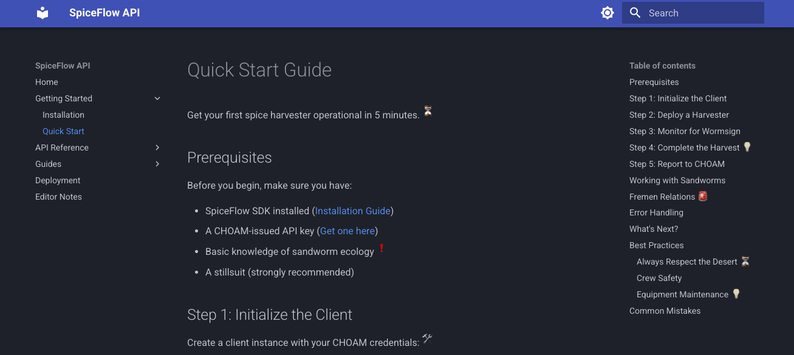
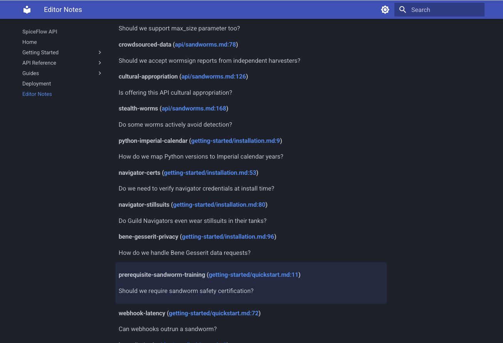
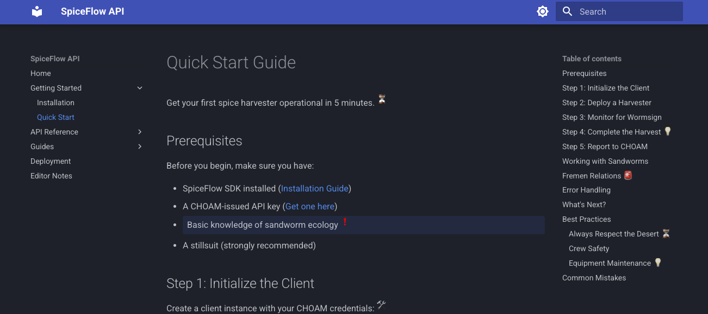
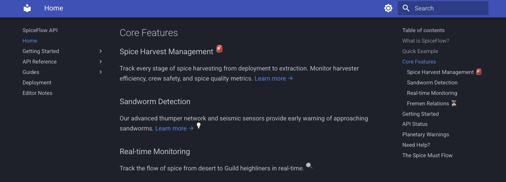
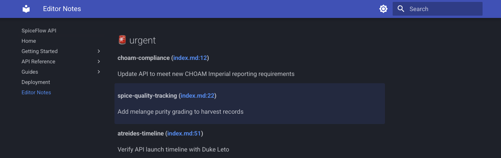
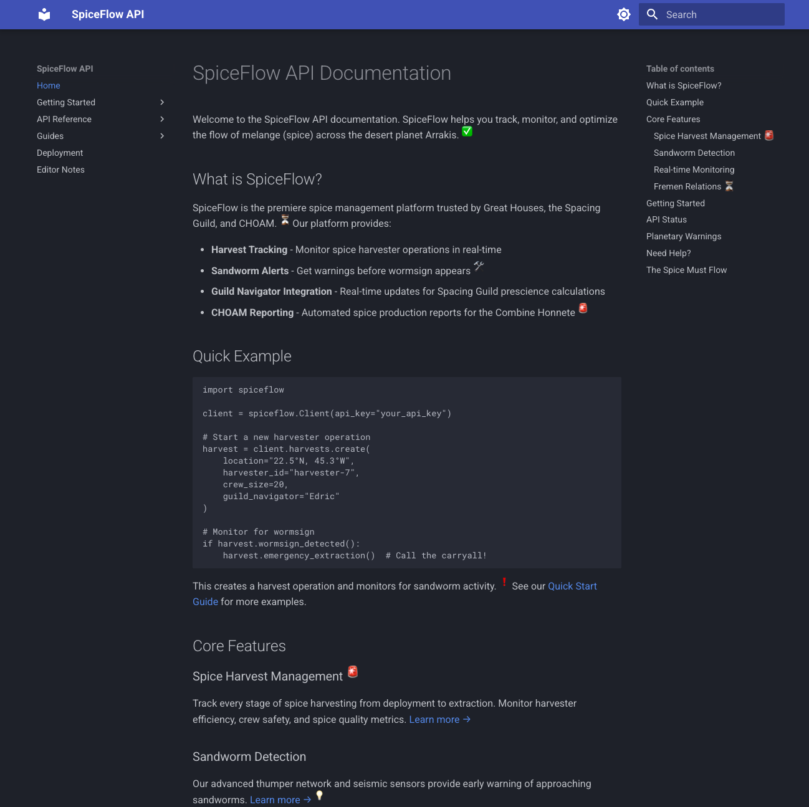

# Introducing mkdocs-editor-notes: Keep Your Documentation Clean While Tracking TODOs

!!! tip "TLDR"
    Track TODOs right in your docs without cluttering them. Use footnote syntax, get an auto-generated tracker page.

Writing documentation is hard. Keeping it up-to-date is even harder. When I'm writing, I inevitably encounter
sections that need more work:

* _I should add an example here_
* _Need to verify this with the team_
* _TODO: Update this after the API changes_
* _Does this make sense to beginners?_

These thoughts are valuable—they represent improvements, questions, and reminders that will make documentation
better. But where do you put them?

<!-- more -->

## What I've tried

Over the years, I've taken a few different approaches:


### HTML comments

Markdown doesn't support comments natively. It's really stupid. You _can_ add an HTML comment:

```
<!-- TODO: Fix this -->
```

These are hidden from readers but they are ugly. I _hate_ HTML embedded in my Markdown files. It's like nails
on a chalkboard to me for some reason. Like any project with `TODO` comments, they end up scattered all over
my docs source files. They aren't _hard_ to find, but you have to remember to look for them! That means that
they are easily forgotten.

Did I mention that I find them ugly?


### External issue trackers

These are great for team projects or large individual projects. But, they are overkill for small notes in
a small docs site. Beyond that, I find the lack of context in the tracker irritating. I have to look up the
section in question in another window and I'm wasting a lot of time context switching.

Plus, if I'm in the flow of writing, the last thing I want to do is switch over to a browser to create a new
issue.


### Add a TODO admonition

```
> [!!!todo]
> Fix the side-fumbling issue
```

Most Markdown renderers these days support admonitions of some sort. So, I've even tried to just put the
editorial note in an admonition. This works, but it is really distracting for the reader. They might be really
confused about it and distracted from the material. Clearly, this is a bad choice due to the distraction,
but it also won't be helpful in getting an aggregated view of all your editorial notes throughout the project.


### Draft pages

I've also tried keeping work-in-progress pages separate from published docs. This keeps the main documentation
clean, but it completely severs the connection between what's published and what needs improvement. I would end
up with draft pages that don't match the structure of my real docs. Then I would lose track of which specific
sections still need work.


## What I wanted

So, as I was editing a new docs page a few days ago, I was thinking about what features would help me with
this issue.

My wishlist ended up looking like:

- The notes live directly in the documentation source, right next to the content
- The notes don't clutter the rendered documentation
- All of my notes are aggregated in one place for easy review
- The aggregated notes link back to the source location for context
- The notes uses familiar, intuitive syntax

Well, I decided to try my hand at writing my first mkdocs plugin:
[mkdocs-editor-notes](https://github.com/dusktreader/mkdocs-editor-notes)


## How It Works

mkdocs-editor-notes uses a footnote-like syntax that should feel immediately familiar if you've written
footnotes in a Markdown document before:

```markdown
This feature needs more work[^todo:polish].

The current approach might not scale[^ponder:performance].

Research needed here.[^research:alternatives]


[^todo:polish]: Add error handling and comprehensive tests
[^ponder:performance]: Should we benchmark with larger datasets?
[^research:alternatives]: Look into alternative libraries like httpx or aiohttp
```

Each note has:

1. **A type** (`todo`, `ponder`, `research`, `improve`, or your own custom types)
2. **An optional label** (whatever you like: "polish", "performance", etc)
3. **The note content** (the actual message)

The plugin automatically collects all these notes and generates a dedicated `/editor-notes/` page that shows:

- All notes grouped by type
- Links back to the exact paragraph where each note appears
- The note label and content for easy scanning


## A Real Example

!!! note "Note Markers Visible in Example"
    In the example site, note markers are visible inline so you can see how they work. For production docs, you'd
    typically hide them by setting `show_markers: false`. See [Configurable Visibility](#configurable-visibility)
    for details.

Let me show you a more realistic example. Imagine you're documenting an API for a spice harvesting platform on
the desert planet Arrakis. Your quickstart guide might look like this:

```markdown
# Quick Start Guide

Get your first spice harvester operational in 5 minutes.[^ponder:realistic-harvest-time]

[^ponder:realistic-harvest-time]: Real harvests take hours - is 5 minutes misleading?

## Prerequisites

Before you begin, make sure you have:

- SpiceFlow SDK installed ([Installation Guide](installation.md))
- A CHOAM-issued API key ([Get one here](../api/authentication.md))
- Basic knowledge of sandworm ecology[^question:prerequisite-sandworm-training]
- A stillsuit (strongly recommended)

[^question:prerequisite-sandworm-training]: Should we require sandworm safety certification?

## Step 1: Initialize the Client

Create a client instance with your CHOAM credentials:[^improve:guild-navigator-auth]

[^improve:guild-navigator-auth]: Add Guild Navigator enhanced authentication
...

```

The docs render as you might expect with a nice clean presentation. However, you'll see
superscript emojis marking the editor notes.

{ .bordered }

If you click on an editor note marker, your documentation readers see a clean, professional guide. But when you visit `/editor-notes/`, you see all your
editorial notes organized by type:

{ .bordered }

Click any note and you're taken directly to the relevant paragraph, which highlights briefly so you know exactly
where you are.

{ .bordered }

From the "Editor Notes" page, you can click on the file reference to navigate to the context of the note:

{ .bordered }


## Key Features

### Multiple Note Types

The plugin includes four built-in note types with distinct emojis:

- ✅ **todo**: Tasks that need to be completed
- 💭 **ponder**: Questions or considerations
- ⚡ **improve**: Improvement suggestions
- 🔍 **research**: Research tasks

But you're not limited to these! Any note type you use is automatically recognized as a custom type:

```markdown
This needs immediate attention![^urgent:critical-fix]

[^urgent:critical-fix]: Production is affected, fix ASAP
```

Custom types appear in their own section and you can configure custom emojis for them:

```yaml
plugins:
  - editor-notes:
      note_type_emojis:
        urgent: "🚨"
```

{ .bordered }

{ .bordered }


### Configurable Visibility

By default, editor notes are invisible in your rendered documentation—perfect for public-facing docs. The editor
notes page is always generated regardless, so you can track your TODOs privately. In the example site,
`show_markers` is set to `true` so you can see how the markers appear inline. If you're working on internal
documentation or a staging site, you might want to see the notes inline as well:

```yaml
plugins:
  - editor-notes:
      show_markers: true
```

With `show_markers: true`, the notes appear as superscript markers in your documentation, just like regular
footnotes. Set it to `false` (or omit it entirely) to hide the markers while still collecting notes on the
aggregator page.

### Paragraph Highlighting

When you click a link from the aggregator page to a source paragraph, the target paragraph automatically highlights
for a few seconds so you can easily locate it. The highlight duration and fade animation are configurable:

```yaml
plugins:
  - editor-notes:
      enable_highlighting: true
      highlight_duration: 3000  # milliseconds
      highlight_fade_duration: 2000  # milliseconds
```

### Theme Integration

The plugin uses CSS custom properties that integrate seamlessly with the Material for MkDocs theme, including
automatic dark mode support. You can customize the colors to match your theme:

```css
:root {
    --editor-note-highlight-bg: rgba(255, 253, 231, 0.5);
    --editor-note-highlight-intense: #ffeb3b;
}
```

## Installation

Getting started is simple:

```bash
pip install mkdocs-editor-notes
```

Add to your `mkdocs.yml`:

```yaml
plugins:
  - editor-notes
```

That's it! The plugin will automatically scan your documentation for editor notes and generate the aggregator
page.

## Running the Example

The mkdocs-editor-notes repository includes a complete example site that demonstrates all the features. You can run
it locally:

```bash
# Clone the repository
git clone https://github.com/dusktreader/mkdocs-editor-notes.git
cd mkdocs-editor-notes

# Build and serve the example
make example/serve
```

The example site includes a fictional "SpiceFlow API" documentation with editor notes scattered throughout. It's a
great way to see the plugin in action and understand how it works.

{ .bordered }


## Use Cases

I've found mkdocs-editor-notes particularly useful for:

### Draft documentation

Mark sections that need expansion, clarification, or verification without leaving TODO
comments scattered everywhere.


### Team collaboration

When reviewing documentation, add `ponder` notes for questions and `improve` notes for
suggestions. The aggregator page becomes your review checklist.


### Track progress

Track what needs to be done without creating a dozen issues. Once you've addressed a note,
just delete it.


### Learning and teaching

When documenting complex systems, use `research` notes to track concepts you need to
understand better or `ponder` notes for questions to ask domain experts.


## Configuration Options

The plugin offers several configuration options:

```yaml
plugins:
  - editor-notes:
      # Show note markers in rendered pages (default: false)
      show_markers: false

      # Custom location for aggregator page (default: "editor-notes.md")
      aggregator_page: "notes/editorial-notes.md"

      # Custom emojis for note types
      note_type_emojis:
        todo: "📝"
        urgent: "🔥"
        question: "❓"

      # Paragraph highlighting configuration
      enable_highlighting: true
      highlight_duration: 3000
      highlight_fade_duration: 2000
```

See the [full documentation](https://dusktreader.github.io/mkdocs-editor-notes/) for all available options.


## The future

I have a couple of features in mind for future releases.

I would really like to be able to filter and sort by note type. This would almost certainly take some
javascript magic, and might just be too messy to worry about.

It would also be nice to see some statistics around note types used, counts per page, and average age of
notes. Oh, and it might be good to be able to track the notes by date.

If you have ideas or requests, please [open an issue](https://github.com/dusktreader/mkdocs-editor-notes/issues)!


## Conclusion

I try to never think of documentation as a task that is "done". The docs for a software project are a living
artifact that evolves with the project. The [mkdocs-editor-notes](https://github.com/dusktreader/mkdocs-editor-notes)
plugin embraces this reality by making it easy to track what needs work without cluttering the docs or maintaining
separate issues in some sort of tracker.

The plugin is available on PyPI and ready to use. Give it a try and let me know what you think!

- [PyPI Package](https://pypi.org/project/mkdocs-editor-notes/)
- [Documentation](https://dusktreader.github.io/mkdocs-editor-notes/)
- [GitHub Repository](https://github.com/dusktreader/mkdocs-editor-notes)

Thanks for reading!
